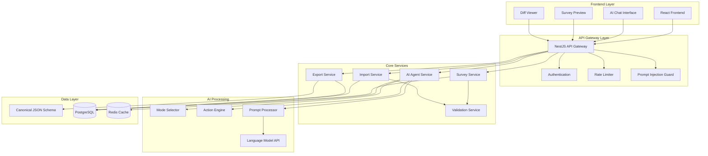
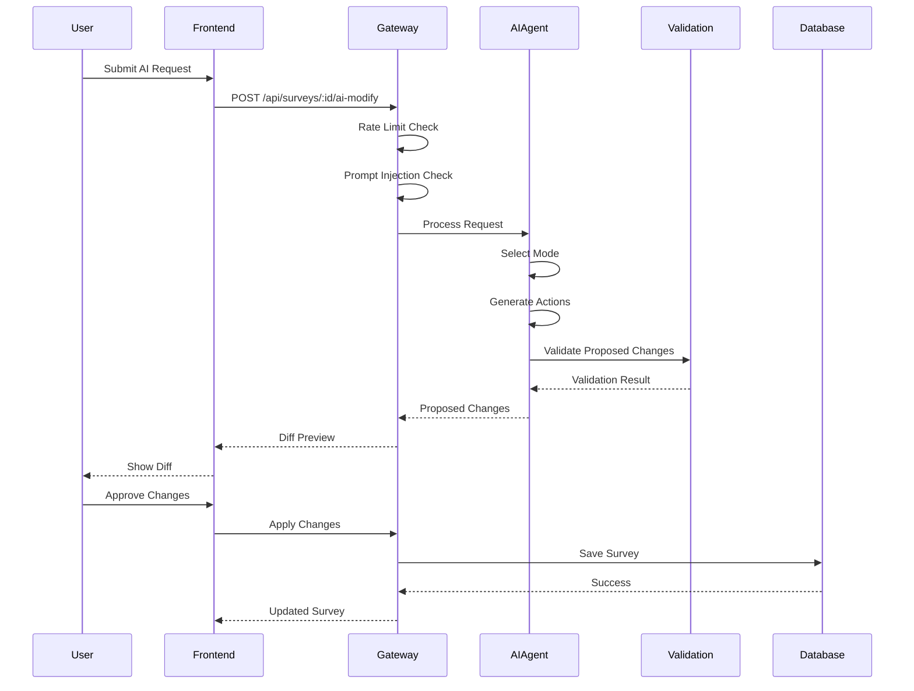

# AI Survey Builder Agent - Design Document

## Overview

The AI Survey Builder Agent is a sophisticated intelligent assistant that enables advertisers to create, modify, and manage surveys through natural language interaction within the campaign creation flow. The system operates on a canonical JSON schema as the single source of truth, providing seamless import/export capabilities, AI-powered enhancements, and comprehensive validation.

### Key Design Principles

1. **Schema-First Architecture**: All operations center around the Canonical JSON Schema v1.0 as the authoritative data format
2. **Action-Based Modifications**: Surgical, precise changes rather than full rewrites to preserve survey integrity
3. **Multi-Modal AI Interaction**: Six distinct AI modes (Generate, Enhance, Normalize, Translate, Analyze, Modify) for specialized tasks
4. **Security-First Design**: Comprehensive prompt injection prevention and rate limiting
5. **Extensible Validation**: Two-tier validation system combining schema and business rule validation
6. **Conversation Continuity**: Persistent context management for natural follow-up interactions

### System Boundaries

The AI Survey Builder Agent operates within the broader survey platform ecosystem, interfacing with:
- Campaign creation workflows (upstream)
- Survey deployment systems (downstream)
- Template libraries (lateral)
- Analytics and reporting systems (lateral)

## Architecture

### High-Level Architecture



### Service Architecture

The system follows a microservices-inspired modular architecture within a monolithic NestJS application:

1. **API Gateway Layer**: Handles authentication, rate limiting, and security
2. **Core Services Layer**: Business logic for surveys, AI processing, and data operations
3. **AI Processing Layer**: Specialized AI components for different operational modes
4. **Data Layer**: Persistent storage and caching with schema validation

### Data Flow Architecture



## Components and Interfaces

### Core Components

#### 1. AI Agent Service

**Purpose**: Central orchestrator for all AI-powered survey operations

**Key Responsibilities**:
- Mode selection and routing
- Conversation context management
- Action generation and validation
- Integration with external LLM APIs

**Interface**:
```typescript
interface AIAgentService {
  processRequest(request: AIRequest): Promise<AIResponse>
  selectMode(prompt: string, context: ConversationContext): AgentMode
  generateActions(prompt: string, survey: CanonicalSurvey, mode: AgentMode): Promise<Action[]>
  validateActions(actions: Action[], survey: CanonicalSurvey): ValidationResult
}

interface AIRequest {
  surveyId: string
  prompt: string
  userId: string
  conversationId?: string
}

interface AIResponse {
  mode: AgentMode
  actions: Action[]
  explanation: string
  conversationId: string
  requiresApproval: boolean
}
```

#### 2. Survey Service

**Purpose**: Core CRUD operations and survey lifecycle management

**Key Responsibilities**:
- Survey creation, retrieval, update, deletion
- Version history management
- Template management
- Survey state transitions

**Interface**:
```typescript
interface SurveyService {
  create(survey: CreateSurveyDto): Promise<Survey>
  findById(id: string): Promise<Survey>
  update(id: string, updates: UpdateSurveyDto): Promise<Survey>
  delete(id: string): Promise<void>
  getVersionHistory(id: string): Promise<SurveyVersion[]>
  rollback(id: string, versionNumber: number): Promise<Survey>
  applyActions(id: string, actions: Action[]): Promise<Survey>
}
```

#### 3. Import Service

**Purpose**: Excel file processing and intelligent data normalization

**Key Responsibilities**:
- Excel file parsing and validation
- Intelligent type inference
- Default value application
- AI-powered normalization

**Interface**:
```typescript
interface ImportService {
  parseExcel(file: Buffer): Promise<ParsedSurveyData>
  inferQuestionTypes(questions: RawQuestion[]): Promise<TypedQuestion[]>
  applyDefaults(survey: PartialSurvey): Promise<CanonicalSurvey>
  normalizeWithAI(survey: CanonicalSurvey): Promise<NormalizationResult>
}

interface ParsedSurveyData {
  questions: RawQuestion[]
  metadata: SurveyMetadata
  errors: ImportError[]
}
```

#### 4. Export Service

**Purpose**: Multi-format survey export with format-specific optimizations

**Key Responsibilities**:
- JSON, Excel, and PDF export generation
- Format-specific rendering
- Download file management

**Interface**:
```typescript
interface ExportService {
  exportToJson(surveyId: string): Promise<Buffer>
  exportToExcel(surveyId: string): Promise<Buffer>
  exportToPdf(surveyId: string): Promise<Buffer>
  generateDownloadUrl(buffer: Buffer, format: ExportFormat): Promise<string>
}
```

#### 5. Validation Service

**Purpose**: Two-tier validation system for schema and business rules

**Key Responsibilities**:
- Zod schema validation
- Business rule validation
- Cross-reference validation
- Error message generation

**Interface**:
```typescript
interface ValidationService {
  validateSchema(survey: unknown): ValidationResult
  validateBusinessRules(survey: CanonicalSurvey): ValidationResult
  validateActions(actions: Action[], survey: CanonicalSurvey): ValidationResult
}

interface ValidationResult {
  isValid: boolean
  errors: ValidationError[]
  warnings: ValidationWarning[]
}
```

### AI Processing Components

#### 1. Mode Selector

**Purpose**: Intelligent routing of requests to appropriate AI modes

**Implementation Strategy**:
- Keyword-based classification
- Intent recognition using embeddings
- Context-aware mode selection
- Fallback to general modify mode

```typescript
interface ModeSelector {
  selectMode(prompt: string, context: ConversationContext): AgentMode
  classifyIntent(prompt: string): Intent[]
  analyzeKeywords(prompt: string): Keyword[]
}

enum AgentMode {
  GENERATE = 'generate',
  MODIFY = 'modify',
  ENHANCE = 'enhance',
  NORMALIZE = 'normalize',
  TRANSLATE = 'translate',
  ANALYZE = 'analyze'
}
```

#### 2. Action Engine

**Purpose**: Decomposition of AI requests into discrete, executable actions

**Action Types**:
- Question operations: `add_question`, `remove_question`, `update_question_text`, `update_question_type`
- Option operations: `add_option`, `remove_option`, `update_option_text`, `reorder_options`
- Logic operations: `add_logic`, `remove_logic`, `update_logic`
- Structure operations: `reorder_questions`, `add_section`, `remove_section`, `update_section`
- Bulk operations: `duplicate_question`, `bulk_update`
- Settings operations: `update_settings`

```typescript
interface ActionEngine {
  generateActions(prompt: string, survey: CanonicalSurvey, mode: AgentMode): Promise<Action[]>
  optimizeActions(actions: Action[]): Action[]
  validateActionSequence(actions: Action[]): ValidationResult
}

interface Action {
  type: ActionType
  target: string
  payload: Record<string, any>
  metadata: ActionMetadata
}
```

#### 3. Prompt Processor

**Purpose**: Secure prompt handling and LLM interaction management

**Security Features**:
- Prompt injection detection
- Input sanitization
- Response validation
- Context isolation

```typescript
interface PromptProcessor {
  processPrompt(prompt: string, context: ProcessingContext): Promise<ProcessedPrompt>
  detectInjection(prompt: string): InjectionDetectionResult
  sanitizeInput(prompt: string): string
  formatForLLM(prompt: string, context: ConversationContext): LLMPrompt
}
```

### Data Models

#### Canonical JSON Schema v1.0

The system's single source of truth for survey data:

```typescript
interface CanonicalSurvey {
  id: string
  version: string // "1.0"
  metadata: SurveyMetadata
  sections: SurveySection[]
  logic: LogicRule[]
  settings: SurveySettings
  createdAt: string
  updatedAt: string
}

interface SurveyMetadata {
  title: string
  description?: string
  language: string
  category?: string
  tags: string[]
  estimatedDuration?: number
}

interface SurveySection {
  id: string
  title?: string
  description?: string
  questions: Question[]
  order: number
}

interface Question {
  id: string
  type: QuestionType
  text: string
  description?: string
  required: boolean
  order: number
  options?: QuestionOption[]
  validation?: ValidationRule[]
  metadata: QuestionMetadata
}

enum QuestionType {
  SINGLE_CHOICE = 'single_choice',
  MULTIPLE_CHOICE = 'multiple_choice',
  TEXT_SHORT = 'text_short',
  TEXT_LONG = 'text_long',
  RATING_SCALE = 'rating_scale',
  LIKERT_SCALE = 'likert_scale',
  RANKING = 'ranking',
  MATRIX_SINGLE = 'matrix_single',
  MATRIX_MULTIPLE = 'matrix_multiple',
  SLIDER = 'slider',
  DATE = 'date',
  TIME = 'time',
  FILE_UPLOAD = 'file_upload',
  YES_NO = 'yes_no'
}

interface QuestionOption {
  id: string
  text: string
  value: string
  order: number
  metadata?: Record<string, any>
}

interface LogicRule {
  id: string
  condition: LogicCondition
  action: LogicAction
  priority: number
}

interface LogicCondition {
  questionId: string
  operator: LogicOperator
  value: any
}

interface LogicAction {
  type: 'show' | 'hide' | 'skip' | 'end'
  target: string
}
```

## Data Models

### Database Schema

The system uses PostgreSQL with JSONB columns for flexible schema storage:

```sql
-- Surveys table
CREATE TABLE surveys (
  id UUID PRIMARY KEY DEFAULT gen_random_uuid(),
  advertiser_id UUID NOT NULL,
  title VARCHAR(255) NOT NULL,
  canonical_json JSONB NOT NULL,
  status VARCHAR(50) DEFAULT 'draft',
  created_at TIMESTAMP DEFAULT NOW(),
  updated_at TIMESTAMP DEFAULT NOW()
);

-- Survey versions for rollback capability
CREATE TABLE survey_versions (
  id UUID PRIMARY KEY DEFAULT gen_random_uuid(),
  survey_id UUID REFERENCES surveys(id) ON DELETE CASCADE,
  version_number INTEGER NOT NULL,
  canonical_json JSONB NOT NULL,
  change_summary TEXT,
  created_at TIMESTAMP DEFAULT NOW()
);

-- Conversation context for AI interactions
CREATE TABLE survey_conversations (
  id UUID PRIMARY KEY DEFAULT gen_random_uuid(),
  survey_id UUID REFERENCES surveys(id) ON DELETE CASCADE,
  messages JSONB NOT NULL DEFAULT '[]',
  created_at TIMESTAMP DEFAULT NOW(),
  updated_at TIMESTAMP DEFAULT NOW()
);

-- Survey templates
CREATE TABLE survey_templates (
  id UUID PRIMARY KEY DEFAULT gen_random_uuid(),
  name VARCHAR(255) NOT NULL,
  description TEXT,
  category VARCHAR(100),
  canonical_json JSONB NOT NULL,
  is_active BOOLEAN DEFAULT true,
  created_at TIMESTAMP DEFAULT NOW()
);

-- Rate limiting tracking
CREATE TABLE rate_limits (
  id UUID PRIMARY KEY DEFAULT gen_random_uuid(),
  user_id UUID NOT NULL,
  endpoint VARCHAR(255) NOT NULL,
  request_count INTEGER DEFAULT 0,
  window_start TIMESTAMP DEFAULT NOW(),
  created_at TIMESTAMP DEFAULT NOW()
);

-- Indexes for performance
CREATE INDEX idx_surveys_advertiser_id ON surveys(advertiser_id);
CREATE INDEX idx_surveys_status ON surveys(status);
CREATE INDEX idx_survey_versions_survey_id ON survey_versions(survey_id);
CREATE INDEX idx_survey_conversations_survey_id ON survey_conversations(survey_id);
CREATE INDEX idx_survey_templates_category ON survey_templates(category);
CREATE INDEX idx_rate_limits_user_endpoint ON rate_limits(user_id, endpoint);
```

### Zod Schema Definitions

Comprehensive validation schemas using Zod for runtime type safety:

```typescript
import { z } from 'zod'

// Question type enum
const QuestionTypeSchema = z.enum([
  'single_choice',
  'multiple_choice', 
  'text_short',
  'text_long',
  'rating_scale',
  'likert_scale',
  'ranking',
  'matrix_single',
  'matrix_multiple',
  'slider',
  'date',
  'time',
  'file_upload',
  'yes_no'
])

// Question option schema
const QuestionOptionSchema = z.object({
  id: z.string().uuid(),
  text: z.string().min(1).max(500),
  value: z.string(),
  order: z.number().int().min(0),
  metadata: z.record(z.any()).optional()
})

// Question schema
const QuestionSchema = z.object({
  id: z.string().uuid(),
  type: QuestionTypeSchema,
  text: z.string().min(1).max(1000),
  description: z.string().max(2000).optional(),
  required: z.boolean(),
  order: z.number().int().min(0),
  options: z.array(QuestionOptionSchema).optional(),
  validation: z.array(z.any()).optional(),
  metadata: z.record(z.any())
})

// Survey section schema
const SurveySectionSchema = z.object({
  id: z.string().uuid(),
  title: z.string().max(255).optional(),
  description: z.string().max(1000).optional(),
  questions: z.array(QuestionSchema),
  order: z.number().int().min(0)
})

// Logic condition and action schemas
const LogicConditionSchema = z.object({
  questionId: z.string().uuid(),
  operator: z.enum(['equals', 'not_equals', 'contains', 'greater_than', 'less_than']),
  value: z.any()
})

const LogicActionSchema = z.object({
  type: z.enum(['show', 'hide', 'skip', 'end']),
  target: z.string()
})

const LogicRuleSchema = z.object({
  id: z.string().uuid(),
  condition: LogicConditionSchema,
  action: LogicActionSchema,
  priority: z.number().int().min(0)
})

// Main canonical survey schema
const CanonicalSurveySchema = z.object({
  id: z.string().uuid(),
  version: z.literal('1.0'),
  metadata: z.object({
    title: z.string().min(1).max(255),
    description: z.string().max(1000).optional(),
    language: z.string().length(2),
    category: z.string().max(100).optional(),
    tags: z.array(z.string()),
    estimatedDuration: z.number().int().min(1).optional()
  }),
  sections: z.array(SurveySectionSchema).min(1),
  logic: z.array(LogicRuleSchema),
  settings: z.object({
    allowAnonymous: z.boolean(),
    randomizeQuestions: z.boolean(),
    showProgressBar: z.boolean(),
    allowBackNavigation: z.boolean(),
    theme: z.string().optional()
  }),
  createdAt: z.string().datetime(),
  updatedAt: z.string().datetime()
})

// Export the main schema
export { CanonicalSurveySchema }
export type CanonicalSurvey = z.infer<typeof CanonicalSurveySchema>
```

## Correctness Properties

*A property is a characteristic or behavior that should hold true across all valid executions of a system-essentially, a formal statement about what the system should do. Properties serve as the bridge between human-readable specifications and machine-verifiable correctness guarantees.*

Before writing the correctness properties, I need to analyze the acceptance criteria to determine which ones are suitable for property-based testing.

### Property 1: Canonical Schema Storage Consistency

*For any* survey data stored in the system, retrieving that survey SHALL return data that conforms to Canonical_JSON_Schema version 1.0

**Validates: Requirements 1.1**

### Property 2: Question Type Completeness

*For any* of the 14 supported question types (single_choice, multiple_choice, text_short, text_long, rating_scale, likert_scale, ranking, matrix_single, matrix_multiple, slider, date, time, file_upload, yes_no), the Canonical_JSON_Schema SHALL accept and validate surveys containing that question type

**Validates: Requirements 1.2**

### Property 3: Import Format Conversion Consistency

*For any* valid input format processed by the Import_Pipeline, the output SHALL always be a valid Canonical_JSON_Schema object

**Validates: Requirements 1.3**

### Property 4: Export Format Conversion Validity

*For any* valid Canonical_JSON_Schema survey, exporting to any supported format (Excel, PDF, JSON) SHALL produce valid output in the target format

**Validates: Requirements 1.4**

### Property 5: AI Operation Schema Preservation

*For any* survey modification performed by the AI_Agent, the resulting survey SHALL maintain valid Canonical_JSON_Schema structure

**Validates: Requirements 1.5**

### Property 6: Excel Parsing Completeness

*For any* valid Excel file containing survey data, the Import_Pipeline SHALL successfully extract all survey questions without data loss

**Validates: Requirements 2.1**

### Property 7: Question Type Inference Validity

*For any* question text and answer options without explicit type specification, the Import_Pipeline SHALL infer a valid question type from the 14 supported types

**Validates: Requirements 2.2**

### Property 8: Default Value Application Completeness

*For any* incomplete survey data, applying intelligent defaults SHALL result in a complete, valid Canonical_JSON_Schema survey

**Validates: Requirements 2.3**

### Property 9: Error Message Specificity

*For any* invalid Excel data, the Import_Pipeline SHALL return error messages that identify specific rows and validation issues

**Validates: Requirements 2.4**

### Property 10: Successful Import Schema Validity

*For any* Excel import that completes successfully, the result SHALL be a valid Canonical_JSON_Schema survey object

**Validates: Requirements 2.5**

### Property 11: Text Normalization Consistency

*For any* inconsistently formatted question text, AI normalization SHALL produce clean, properly formatted text while preserving semantic meaning

**Validates: Requirements 3.1**

### Property 12: Question Classification Validity

*For any* ambiguous question, AI classification SHALL assign it to one of the 14 valid Canonical_JSON_Schema question types

**Validates: Requirements 3.2**

### Property 13: Survey Generation Completeness

*For any* natural language prompt requesting survey creation, the AI_Agent SHALL generate a complete, valid Canonical_JSON_Schema survey

**Validates: Requirements 4.1**

### Property 14: Action Decomposition Validity

*For any* survey modification request, the AI_Agent SHALL decompose it into a sequence of valid Action operations from the 18 supported action types

**Validates: Requirements 5.1, 5.2**

### Property 15: Surgical Modification Preservation

*For any* survey modification, only the explicitly targeted elements SHALL change, while all other survey elements SHALL remain unchanged

**Validates: Requirements 5.4, 5.5**

### Property 16: Schema Validation Consistency

*For any* survey data, Zod schema validation SHALL return consistent results when applied multiple times to the same data

**Validates: Requirements 9.1**

### Property 17: Validation Sequence Completeness

*For any* survey that passes Zod schema validation, business rules validation SHALL always be performed

**Validates: Requirements 9.2**

### Property 18: Logic Reference Validity

*For any* survey with logic rules, all question IDs referenced in the logic SHALL exist as valid questions in the survey

**Validates: Requirements 9.3**

### Property 19: Conditional Logic Operator Validity

*For any* conditional logic rule, the operators and values used SHALL be valid for the referenced question type

**Validates: Requirements 9.4**

### Property 20: JSON Parsing Consistency

*For any* valid JSON input, the Parser SHALL produce a valid Canonical_JSON_Schema object that passes all validation checks

**Validates: Requirements 22.1**

### Property 21: JSON Error Message Specificity

*For any* invalid JSON input, the Parser SHALL return descriptive error messages that identify specific schema violations

**Validates: Requirements 22.2**

### Property 22: JSON Formatting Consistency

*For any* Canonical_JSON_Schema object, the Pretty_Printer SHALL produce JSON with consistent indentation, field ordering, and formatting

**Validates: Requirements 22.3**

### Property 23: JSON Round-Trip Preservation

*For any* valid Canonical_JSON_Schema object, parsing then printing then parsing SHALL produce an equivalent object (round-trip property)

**Validates: Requirements 22.4**

## Error Handling

### Error Classification System

The system implements a comprehensive error classification and handling strategy:

#### 1. Validation Errors
- **Schema Validation Errors**: Zod schema violations with specific field-level error messages
- **Business Rule Errors**: Logic reference errors, invalid operators, missing required relationships
- **Cross-Reference Errors**: Invalid question IDs in logic rules, orphaned references

#### 2. Import Errors
- **File Format Errors**: Invalid Excel file structure, unsupported file types
- **Data Quality Errors**: Missing required columns, invalid data types, malformed content
- **Inference Errors**: Unable to determine question type, ambiguous data structures

#### 3. AI Processing Errors
- **Prompt Injection Errors**: Detected malicious prompts, security violations
- **Generation Errors**: Unable to generate valid survey from prompt, incomplete responses
- **Action Errors**: Invalid action sequences, conflicting modifications

#### 4. System Errors
- **Rate Limit Errors**: API quota exceeded, temporary throttling
- **Database Errors**: Connection failures, constraint violations, transaction rollbacks
- **External Service Errors**: LLM API failures, timeout errors, service unavailability

### Error Recovery Strategies

#### Graceful Degradation
- **Partial Import Success**: Import valid questions while reporting errors for invalid ones
- **Fallback Modes**: Use simpler AI modes when advanced features fail
- **Cached Responses**: Serve cached results when external services are unavailable

#### User-Friendly Error Messages
```typescript
interface ErrorResponse {
  code: string
  message: string
  details: ErrorDetail[]
  suggestions: string[]
  recoveryActions: RecoveryAction[]
}

interface ErrorDetail {
  field?: string
  row?: number
  column?: string
  value?: any
  constraint: string
}

interface RecoveryAction {
  type: 'retry' | 'modify' | 'skip' | 'fallback'
  description: string
  action: string
}
```

#### Automatic Recovery
- **Retry Logic**: Exponential backoff for transient failures
- **Circuit Breakers**: Prevent cascade failures in external service calls
- **Rollback Capability**: Automatic rollback on critical validation failures

## Testing Strategy

### Dual Testing Approach

The AI Survey Builder Agent requires comprehensive testing across multiple dimensions:

#### Unit Testing Strategy
- **Component Isolation**: Test individual services and components in isolation
- **Mock Dependencies**: Mock external services (LLM APIs, database) for consistent testing
- **Edge Case Coverage**: Test boundary conditions, error scenarios, and invalid inputs
- **Business Logic Validation**: Verify complex business rules and validation logic

#### Property-Based Testing Strategy

Given the complex data transformations and AI-powered operations, property-based testing is highly appropriate for this feature. The system involves:
- Pure functions with clear input/output behavior (parsers, validators, formatters)
- Universal properties that should hold across wide input spaces (schema validation, round-trips)
- Data transformations with invariants (import/export, AI modifications)

**Property Test Configuration**:
- Minimum 100 iterations per property test
- Custom generators for survey data, Excel files, and AI prompts
- Shrinking strategies for complex nested data structures
- Property test library: **fast-check** for TypeScript/JavaScript

**Property Test Implementation Requirements**:
```typescript
// Example property test structure
describe('Property Tests', () => {
  it('should preserve schema validity through AI modifications', () => {
    fc.assert(fc.property(
      surveyGenerator,
      modificationRequestGenerator,
      (survey, request) => {
        const result = aiAgent.processModification(survey, request)
        expect(validateSchema(result)).toBe(true)
      }
    ), { numRuns: 100 })
  })
})
```

Each property test must include a comment referencing its design document property:
```typescript
// Feature: ai-survey-builder-agent, Property 23: JSON Round-Trip Preservation
```

#### Integration Testing Strategy
- **API Endpoint Testing**: Test complete request/response cycles
- **Database Integration**: Test data persistence and retrieval
- **External Service Integration**: Test LLM API integration with real services
- **File Processing Integration**: Test Excel import/export with real files

#### Security Testing Strategy
- **Prompt Injection Testing**: Test various injection attack vectors
- **Rate Limiting Testing**: Verify rate limiting enforcement
- **Input Sanitization Testing**: Test malicious input handling
- **Authentication Testing**: Verify access control mechanisms

#### Performance Testing Strategy
- **Load Testing**: Test system behavior under high concurrent usage
- **Memory Testing**: Verify efficient memory usage during large file processing
- **Response Time Testing**: Ensure acceptable response times for AI operations
- **Scalability Testing**: Test system scaling characteristics

### Test Data Management

#### Synthetic Data Generation
- **Survey Generators**: Create realistic survey structures for testing
- **Excel File Generators**: Generate various Excel file formats and structures
- **Prompt Generators**: Create diverse natural language prompts for AI testing
- **Error Scenario Generators**: Generate invalid data for error handling tests

#### Test Environment Management
- **Isolated Test Databases**: Separate test data from production
- **Mock LLM Services**: Controllable AI responses for consistent testing
- **Containerized Testing**: Docker-based test environments for consistency
- **CI/CD Integration**: Automated testing in deployment pipelines

### Quality Metrics

#### Code Coverage Targets
- **Unit Test Coverage**: Minimum 90% line coverage
- **Integration Test Coverage**: Minimum 80% endpoint coverage
- **Property Test Coverage**: 100% coverage of identified properties
- **Security Test Coverage**: 100% coverage of security-critical paths

#### Performance Benchmarks
- **API Response Times**: < 2 seconds for standard operations, < 10 seconds for AI operations
- **File Processing**: < 30 seconds for Excel files up to 10MB
- **Memory Usage**: < 512MB per concurrent user session
- **Database Query Performance**: < 100ms for standard queries

#### Reliability Metrics
- **Uptime Target**: 99.9% availability
- **Error Rate Target**: < 0.1% for user-facing operations
- **Data Integrity**: 100% accuracy for import/export operations
- **Security Incident Target**: Zero successful prompt injection attacks

This comprehensive testing strategy ensures the AI Survey Builder Agent maintains high quality, security, and reliability while handling the complex interactions between AI processing, data validation, and user workflows.