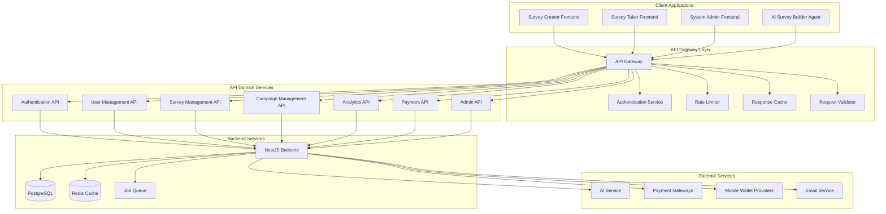

# Design Document: REST API Des ign

## Overview

The REST API Design serves as the unified data layer for the Vibe Survey platform - a comprehensive Survey-as-Ads marketplace connecting advertisers, survey takers, and platform administrators. This API provides a cohesive interface serving three distinct frontend applications (Survey Creator Frontend, Survey Taker Frontend, System Admin Frontend), an AI Survey Builder Agent, and a scalable NestJS backend implementation.

The API architecture emphasizes consistency, scalability, and maintainability while supporting high-traffic scenarios, real-time operations, and complex business logic. With 200+ endpoints organized across 18 functional domains, the API implements comprehensive versioning, security, caching, and performance optimization strategies.

**Complete API Routes Specification**: The comprehensive API routes are documented in the [Unified API Routes Design](./unified-api-routes.md) which provides detailed endpoint specifications, request/response examples, and implementation guidelines for all 200+ API endpoints.

### Key Design Principles

1. **Unified Resource Model**: Consistent data structures and operations across all client applications
2. **Domain-Driven Organization**: Logical grouping of endpoints by business domain (auth, surveys, campaigns, users, admin, analytics, payments)
3. **Version-First Architecture**: URL path versioning with backward compatibility guarantees
4. **Security-First Design**: Comprehensive authentication, authorization, and input validation
5. **Performance-Optimized**: Intelligent caching, pagination, and bulk operations
6. **Real-Time Capable**: WebSocket and SSE integration for live updates
7. **Mobile-Optimized**: Efficient payloads and offline-first capabilities

### System Integration

The API serves as the central nervous system connecting:
- **Survey Creator Frontend**: Campaign creation, survey building, analytics
- **Survey Taker Frontend**: Survey discovery, completion, rewards management
- **System Admin Frontend**: Platform management, moderation, compliance
- **AI Survey Builder Agent**: Natural language survey generation and modification
- **NestJS Backend**: Business logic, data persistence, external integrations

## Architecture

### High-Level Architecture



### API Versioning Strategy

The API implements URL path versioning with semantic versioning principles:

```
/api/v1/    - Current stable version
/api/v2/    - Next major version (when available)
/api/beta/  - Beta features and experimental endpoints
```

**Version Lifecycle Management**:
- Minimum 2 concurrent versions supported
- 12-month deprecation notice for major versions
- Backward compatibility within minor versions
- Clear migration guides for version transitions

### Domain Organization

The API is organized into 7 primary resource domains:

1. **Authentication Domain** (`/api/v1/auth/`)
   - User registration, login, token management
   - Multi-factor authentication, OAuth integration
   - Session management, device fingerprinting

2. **User Management Domain** (`/api/v1/users/`)
   - Profile management, preferences, notifications
   - Trust tier calculation, consent tracking
   - Account lifecycle, data export

3. **Survey Management Domain** (`/api/v1/surveys/`)
   - CRUD operations, versioning, templates
   - AI integration, import/export, validation
   - Question banks, logic flows, previews

4. **Campaign Management Domain** (`/api/v1/campaigns/`)
   - Lifecycle management, targeting, budgets
   - Approval workflows, performance tracking
   - Audience estimation, optimization

5. **Analytics Domain** (`/api/v1/analytics/`)
   - Real-time metrics, demographic analysis
   - Custom reports, data exports
   - Trend analysis, benchmarking

6. **Payment Domain** (`/api/v1/payments/`)
   - Wallet management, transactions, withdrawals
   - Mobile wallet integration, currency conversion
   - Billing, invoicing, reconciliation

7. **Admin Domain** (`/api/v1/admin/`)
   - Platform management, user moderation
   - Content review, compliance tools
   - System configuration, audit trails

## Components and Interfaces

### Core API Components

#### 1. Authentication and Authorization System

**Purpose**: Provides secure access control across all API endpoints with role-based permissions.

**Key Features**:
- JWT-based authentication with refresh token rotation
- Multi-factor authentication support
- Role-based access control (RBAC)
- Device fingerprinting and fraud detection
- OAuth integration (Google, Facebook)

**Core Endpoints**:
```typescript
// Authentication endpoints
POST   /api/v1/auth/register
POST   /api/v1/auth/login
POST   /api/v1/auth/refresh
POST   /api/v1/auth/logout
POST   /api/v1/auth/verify-phone
POST   /api/v1/auth/forgot-password
POST   /api/v1/auth/reset-password
GET    /api/v1/auth/me
POST   /api/v1/auth/mfa/setup
POST   /api/v1/auth/mfa/verify
```

**Request/Response Models**:
```typescript
interface LoginRequest {
  email: string;
  password: string;
  deviceFingerprint?: string;
  rememberMe?: boolean;
}

interface AuthResponse {
  accessToken: string;
  refreshToken: string;
  user: UserProfile;
  expiresIn: number;
  permissions: Permission[];
}

interface Permission {
  resource: string;
  actions: string[];
  conditions?: Record<string, any>;
}
```

#### 2. Survey Management API

**Purpose**: Comprehensive survey lifecycle management with AI integration and multi-format support.

**Key Features**:
- Canonical JSON schema validation
- AI-powered survey generation and modification
- Version control and rollback capabilities
- Multi-format import/export (Excel, PDF, JSON)
- Template library and question banks

**Core Endpoints**:
```typescript
// Survey CRUD operations
GET    /api/v1/surveys
POST   /api/v1/surveys
GET    /api/v1/surveys/:id
PUT    /api/v1/surveys/:id
DELETE /api/v1/surveys/:id

// Survey AI integration
POST   /api/v1/surveys/ai/generate
POST   /api/v1/surveys/:id/ai/modify
POST   /api/v1/surveys/:id/ai/enhance
POST   /api/v1/surveys/:id/ai/translate
POST   /api/v1/surveys/:id/ai/analyze

// Survey import/export
POST   /api/v1/surveys/import
GET    /api/v1/surveys/:id/export
GET    /api/v1/surveys/import/status/:jobId
GET    /api/v1/surveys/export/status/:jobId

// Survey versioning
GET    /api/v1/surveys/:id/versions
POST   /api/v1/surveys/:id/rollback
POST   /api/v1/surveys/:id/duplicate

// Survey validation and preview
POST   /api/v1/surveys/validate
GET    /api/v1/surveys/:id/preview
```

**Survey Data Model**:
```typescript
interface Survey {
  id: string;
  version: string;
  metadata: SurveyMetadata;
  sections: SurveySection[];
  logic: LogicRule[];
  settings: SurveySettings;
  status: SurveyStatus;
  createdAt: string;
  updatedAt: string;
}

interface SurveyMetadata {
  title: string;
  description?: string;
  language: string;
  category?: string;
  tags: string[];
  estimatedDuration?: number;
  targetAudience?: AudienceProfile;
}

interface SurveySection {
  id: string;
  title?: string;
  description?: string;
  questions: Question[];
  order: number;
}

interface Question {
  id: string;
  type: QuestionType;
  text: string;
  description?: string;
  required: boolean;
  order: number;
  options?: QuestionOption[];
  validation?: ValidationRule[];
  metadata: QuestionMetadata;
}

enum QuestionType {
  SINGLE_CHOICE = 'single_choice',
  MULTIPLE_CHOICE = 'multiple_choice',
  TEXT_SHORT = 'text_short',
  TEXT_LONG = 'text_long',
  RATING_SCALE = 'rating_scale',
  LIKERT_SCALE = 'likert_scale',
  RANKING = 'ranking',
  MATRIX_SINGLE = 'matrix_single',
  MATRIX_MULTIPLE = 'matrix_multiple',
  SLIDER = 'slider',
  DATE = 'date',
  TIME = 'time',
  FILE_UPLOAD = 'file_upload',
  YES_NO = 'yes_no'
}
```

#### 3. Campaign Management API

**Purpose**: Complete campaign lifecycle management with targeting, budgets, and performance tracking.

**Key Features**:
- Campaign status workflow management
- Advanced audience targeting with real-time estimation
- Budget management and spending controls
- Performance analytics and optimization
- Approval workflows and compliance checks

**Core Endpoints**:
```typescript
// Campaign CRUD operations
GET    /api/v1/campaigns
POST   /api/v1/campaigns
GET    /api/v1/campaigns/:id
PUT    /api/v1/campaigns/:id
DELETE /api/v1/campaigns/:id

// Campaign lifecycle management
POST   /api/v1/campaigns/:id/submit
POST   /api/v1/campaigns/:id/activate
POST   /api/v1/campaigns/:id/pause
POST   /api/v1/campaigns/:id/archive

// Audience targeting
POST   /api/v1/campaigns/:id/targeting
GET    /api/v1/campaigns/:id/targeting
POST   /api/v1/targeting/estimate
GET    /api/v1/targeting/demographics
GET    /api/v1/targeting/interests
POST   /api/v1/targeting/lookalike

// Budget management
GET    /api/v1/campaigns/:id/budget
PUT    /api/v1/campaigns/:id/budget
GET    /api/v1/billing/wallet
POST   /api/v1/billing/wallet/topup
GET    /api/v1/billing/transactions
```

**Campaign Data Model**:
```typescript
interface Campaign {
  id: string;
  advertiserId: string;
  name: string;
  objective: CampaignObjective;
  survey: Survey;
  targeting: AudienceTargeting;
  budget: BudgetSettings;
  status: CampaignStatus;
  analytics: CampaignAnalytics;
  createdAt: string;
  updatedAt: string;
}

interface AudienceTargeting {
  demographics: DemographicFilter[];
  interests: InterestFilter[];
  behaviors: BehaviorFilter[];
  customScreeners: ScreenerQuestion[];
  estimatedReach: AudienceEstimate;
}

interface BudgetSettings {
  totalBudget: number;
  dailyCap?: number;
  costPerResponse: number;
  segmentQuotas: SegmentQuota[];
  spentAmount: number;
  remainingBudget: number;
}

enum CampaignStatus {
  DRAFT = 'draft',
  PENDING_REVIEW = 'pending_review',
  APPROVED = 'approved',
  ACTIVE = 'active',
  PAUSED = 'paused',
  COMPLETED = 'completed',
  ARCHIVED = 'archived'
}
```

#### 4. Survey Taking API

**Purpose**: Optimized survey discovery and completion experience with fraud detection.

**Key Features**:
- Personalized survey feed with matching algorithms
- Progressive survey rendering with branching logic
- Real-time fraud detection and behavioral analysis
- Auto-save and resume functionality
- Reward calculation and approval workflows

**Core Endpoints**:
```typescript
// Survey discovery
GET    /api/v1/surveys/feed
GET    /api/v1/surveys/:id/screener
POST   /api/v1/surveys/:id/screener

// Survey taking
GET    /api/v1/surveys/:id/questions
POST   /api/v1/surveys/:id/responses
PUT    /api/v1/surveys/:id/responses/autosave
GET    /api/v1/surveys/:id/responses/resume
POST   /api/v1/surveys/:id/complete

// Behavioral tracking
POST   /api/v1/surveys/:id/behavioral-data
GET    /api/v1/surveys/:id/fraud-analysis
```

**Survey Response Model**:
```typescript
interface SurveyResponse {
  id: string;
  surveyId: string;
  userId: string;
  answers: ResponseAnswer[];
  behavioralData: BehavioralSignals;
  fraudAnalysis: FraudAnalysis;
  status: ResponseStatus;
  startedAt: string;
  completedAt?: string;
}

interface ResponseAnswer {
  questionId: string;
  answer: any;
  responseTime: number;
  metadata: AnswerMetadata;
}

interface BehavioralSignals {
  responseTime: number;
  mouseMovements: MouseEvent[];
  scrollEvents: ScrollEvent[];
  clickPatterns: ClickEvent[];
  focusEvents: FocusEvent[];
  interactionDepth: InteractionMetrics;
}

interface FraudAnalysis {
  fraudConfidenceScore: number; // 0-100
  qualityLabel: QualityLabel;
  flaggedSignals: FlaggedSignal[];
  calculatedAt: string;
}

enum QualityLabel {
  HIGH_QUALITY = 'High Quality',
  SUSPICIOUS = 'Suspicious',
  LIKELY_FRAUD = 'Likely Fraud'
}
```

#### 5. Analytics and Reporting API

**Purpose**: Comprehensive analytics with real-time metrics and customizable reporting.

**Key Features**:
- Real-time campaign performance metrics
- Demographic analysis and cross-tabulation
- Custom report generation and scheduling
- Data export with anonymization options
- Trend analysis and forecasting

**Core Endpoints**:
```typescript
// Campaign analytics
GET    /api/v1/campaigns/:id/analytics
GET    /api/v1/campaigns/:id/responses
GET    /api/v1/campaigns/:id/demographics
GET    /api/v1/campaigns/:id/quality

// Dashboard and reporting
GET    /api/v1/analytics/dashboard
GET    /api/v1/analytics/trends
POST   /api/v1/campaigns/:id/export
GET    /api/v1/analytics/reports
POST   /api/v1/analytics/reports
```

**Analytics Data Model**:
```typescript
interface CampaignAnalytics {
  totalResponses: number;
  qualifiedResponses: number;
  completionRate: number;
  averageCompletionTime: number;
  fraudScore: FraudScoreDistribution;
  costPerResponse: number;
  demographicBreakdown: DemographicData;
  qualityMetrics: QualityMetrics;
  trendData: TrendAnalysis;
}

interface DemographicBreakdown {
  age: AgeDistribution;
  gender: GenderDistribution;
  location: LocationDistribution;
  education: EducationDistribution;
  income: IncomeDistribution;
}
```

#### 6. Payment and Rewards API

**Purpose**: Comprehensive payment processing with mobile wallet integration.

**Key Features**:
- Multi-provider mobile wallet integration
- Real-time currency conversion
- Automated payout processing
- Transaction history and reconciliation
- Fraud prevention and compliance

**Core Endpoints**:
```typescript
// Wallet management
GET    /api/v1/rewards/wallet
GET    /api/v1/rewards/transactions
POST   /api/v1/rewards/withdraw
GET    /api/v1/rewards/withdrawals
PUT    /api/v1/rewards/withdrawals/:id/retry

// Payment processing
GET    /api/v1/rewards/exchange-rates
GET    /api/v1/rewards/payment-methods
POST   /api/v1/billing/payment-methods
GET    /api/v1/billing/invoices
GET    /api/v1/billing/invoices/:id
```

**Payment Data Model**:
```typescript
interface WalletData {
  approvedPoints: number;
  pendingPoints: number;
  lifetimeEarnings: number;
  transactions: Transaction[];
  withdrawalThreshold: number;
}

interface Transaction {
  id: string;
  userId: string;
  type: TransactionType;
  amount: number;
  currency: string;
  status: TransactionStatus;
  provider?: PaymentProvider;
  metadata: TransactionMetadata;
  createdAt: string;
  completedAt?: string;
}

enum PaymentProvider {
  ABA_PAY = 'aba_pay',
  WING = 'wing',
  TRUE_MONEY = 'true_money',
  BANK_TRANSFER = 'bank_transfer'
}
```

#### 7. Admin Management API

**Purpose**: Comprehensive platform administration with role-based access control.

**Key Features**:
- Campaign review and approval workflows
- Content moderation and user management
- Data governance and compliance tools
- System configuration and monitoring
- Audit trails and reporting

**Core Endpoints**:
```typescript
// Campaign management
GET    /api/v1/admin/campaigns/review-queue
POST   /api/v1/admin/campaigns/:id/approve
POST   /api/v1/admin/campaigns/:id/reject

// User management
GET    /api/v1/admin/users
PUT    /api/v1/admin/users/:id/status
GET    /api/v1/admin/moderation/queue
POST   /api/v1/admin/moderation/:id/action

// Data management
GET    /api/v1/admin/data/quality
POST   /api/v1/admin/data/export
DELETE /api/v1/admin/data/responses/:id
GET    /api/v1/admin/compliance/requests
POST   /api/v1/admin/compliance/requests/:id/approve

// System management
GET    /api/v1/admin/config/platform
PUT    /api/v1/admin/config/platform
GET    /api/v1/admin/config/features
PUT    /api/v1/admin/config/features/:feature
GET    /api/v1/admin/system/health
GET    /api/v1/admin/system/metrics
GET    /api/v1/admin/audit-logs
```

### Cross-Cutting Concerns

#### 1. Real-Time Communication

**WebSocket Integration**:
```typescript
// WebSocket endpoints for real-time updates
WS     /api/v1/ws/campaigns/:id/analytics
WS     /api/v1/ws/surveys/:id/responses
WS     /api/v1/ws/notifications
WS     /api/v1/ws/admin/queue-updates
```

**Server-Sent Events**:
```typescript
// SSE endpoints for one-way real-time updates
GET    /api/v1/sse/notifications
GET    /api/v1/sse/campaigns/:id/metrics
GET    /api/v1/sse/admin/system-status
```

#### 2. Notification System

**Notification Endpoints**:
```typescript
GET    /api/v1/notifications
PUT    /api/v1/notifications/:id/read
POST   /api/v1/notifications/preferences
POST   /api/v1/notifications/push/subscribe
POST   /api/v1/webhooks/register
GET    /api/v1/webhooks
```

#### 3. File Management

**File Upload/Download**:
```typescript
POST   /api/v1/files/upload
GET    /api/v1/files/:id/download
DELETE /api/v1/files/:id
GET    /api/v1/files/:id/metadata
```

## Data Models

### Core Data Models

#### User and Authentication Models

```typescript
interface User {
  id: string;
  email: string;
  phone?: string;
  profile: UserProfile;
  trustTier: TrustTier;
  preferences: UserPreferences;
  isVerified: boolean;
  status: UserStatus;
  createdAt: string;
  updatedAt: string;
}

interface UserProfile {
  firstName: string;
  lastName: string;
  age?: number;
  gender?: Gender;
  location?: Location;
  education?: EducationLevel;
  employment?: EmploymentStatus;
  incomeRange?: IncomeRange;
  interests: Interest[];
  completeness: number; // 0-100%
}

interface TrustTier {
  level: 'Bronze' | 'Silver' | 'Gold' | 'Platinum';
  benefits: TierBenefits;
  requirements: TierRequirements;
  progress: number; // 0-100%
}

enum UserStatus {
  ACTIVE = 'active',
  PENDING_VERIFICATION = 'pending_verification',
  SUSPENDED = 'suspended',
  BANNED = 'banned'
}
```

#### Survey and Campaign Models

```typescript
interface Survey {
  id: string;
  version: string;
  metadata: SurveyMetadata;
  sections: SurveySection[];
  logic: LogicRule[];
  settings: SurveySettings;
  status: SurveyStatus;
  ownerId: string;
  createdAt: string;
  updatedAt: string;
}

interface Campaign {
  id: string;
  advertiserId: string;
  name: string;
  objective: CampaignObjective;
  surveyId: string;
  targeting: AudienceTargeting;
  budget: BudgetSettings;
  status: CampaignStatus;
  analytics: CampaignAnalytics;
  createdAt: string;
  updatedAt: string;
}

enum CampaignObjective {
  BRAND_AWARENESS = 'brand_awareness',
  MARKET_RESEARCH = 'market_research',
  PRODUCT_FEEDBACK = 'product_feedback',
  CUSTOMER_SATISFACTION = 'customer_satisfaction',
  LEAD_GENERATION = 'lead_generation'
}
```

#### Response and Analytics Models

```typescript
interface SurveyResponse {
  id: string;
  surveyId: string;
  campaignId: string;
  userId: string;
  answers: ResponseAnswer[];
  behavioralData: BehavioralSignals;
  fraudAnalysis: FraudAnalysis;
  status: ResponseStatus;
  startedAt: string;
  completedAt?: string;
  approvedAt?: string;
}

interface CampaignAnalytics {
  campaignId: string;
  totalResponses: number;
  qualifiedResponses: number;
  completionRate: number;
  averageCompletionTime: number;
  costPerResponse: number;
  fraudScoreDistribution: FraudScoreDistribution;
  demographicBreakdown: DemographicBreakdown;
  qualityMetrics: QualityMetrics;
  lastUpdated: string;
}
```

### API Response Formats

#### Standard Response Envelope

```typescript
interface ApiResponse<T> {
  success: boolean;
  data?: T;
  error?: ApiError;
  meta?: ResponseMeta;
}

interface ApiError {
  code: string;
  message: string;
  details?: ErrorDetail[];
  timestamp: string;
  requestId: string;
}

interface ResponseMeta {
  pagination?: PaginationMeta;
  version: string;
  timestamp: string;
  requestId: string;
}

interface PaginationMeta {
  page: number;
  limit: number;
  total: number;
  totalPages: number;
  hasNext: boolean;
  hasPrev: boolean;
}
```

#### Error Response Format

```typescript
interface ErrorDetail {
  field?: string;
  code: string;
  message: string;
  value?: any;
}

// Example error response
{
  "success": false,
  "error": {
    "code": "VALIDATION_ERROR",
    "message": "Request validation failed",
    "details": [
      {
        "field": "email",
        "code": "INVALID_FORMAT",
        "message": "Email format is invalid",
        "value": "invalid-email"
      }
    ],
    "timestamp": "2024-01-15T10:30:00Z",
    "requestId": "req_123456789"
  },
  "meta": {
    "version": "1.0",
    "timestamp": "2024-01-15T10:30:00Z",
    "requestId": "req_123456789"
  }
}
```

## Correctness Properties

*A property is a characteristic or behavior that should hold true across all valid executions of a system-essentially, a formal statement about what the system should do. Properties serve as the bridge between human-readable specifications and machine-verifiable correctness guarantees.*
Based on the prework analysis, the following properties have been identified as suitable for property-based testing:

### Property 1: API Versioning URL Pattern Consistency

*For any* valid API endpoint, the URL should follow the versioning pattern (/api/v{version}/) and include the correct X-API-Version header in responses.

**Validates: Requirements 1.1, 1.6**

### Property 2: Resource Domain Organization

*For any* API endpoint, it should belong to one of the defined resource domains (auth, surveys, campaigns, users, admin, analytics, payments) and follow the domain organization pattern.

**Validates: Requirements 1.3**

### Property 3: RESTful URL Convention Compliance

*For any* resource URL, it should use nouns for resources and follow RESTful naming conventions without verbs in the resource path.

**Validates: Requirements 1.4**

### Property 4: Content Negotiation Header Handling

*For any* API endpoint and any valid Accept header (JSON, XML), the response should return the appropriate content-type and format.

**Validates: Requirements 1.5**

### Property 5: Role-Based Access Control Enforcement

*For any* protected endpoint and any user role, access should be granted or denied based on the user's role permissions according to RBAC rules.

**Validates: Requirements 2.8**

### Property 6: Profile Completeness Calculation Accuracy

*For any* user profile data, the completeness percentage should accurately reflect the proportion of completed required fields (completed fields / total required fields * 100).

**Validates: Requirements 3.9**

### Property 7: Survey Schema Validation Consistency

*For any* survey data (valid or invalid), the canonical JSON schema validation should consistently accept valid surveys and reject invalid ones with appropriate error messages.

**Validates: Requirements 4.1**

### Property 8: Survey Version Control Integrity

*For any* survey update operation, the version control system should correctly increment version numbers and preserve complete version history.

**Validates: Requirements 4.4**

### Property 9: AI Endpoint Rate Limiting Enforcement

*For any* user and any AI endpoint, rate limiting should consistently enforce the 100 requests per hour limit and reset appropriately.

**Validates: Requirements 5.7**

### Property 10: Campaign Status Transition Validation

*For any* campaign in any valid state, only valid status transitions should be allowed while invalid transitions are rejected with appropriate error messages.

**Validates: Requirements 7.5**

### Property 11: Audience Size Calculation Consistency

*For any* targeting criteria, audience size calculations should produce consistent results and caching should improve response times without affecting accuracy.

**Validates: Requirements 8.7**

### Property 12: Branching Logic Evaluation Correctness

*For any* survey with branching logic and any response pattern, the question flow should be evaluated correctly according to the defined logic rules.

**Validates: Requirements 10.4**

### Property 13: Fraud Score Range Validation

*For any* survey response data, fraud confidence scores should always be calculated within the valid range of 0 to 100.

**Validates: Requirements 11.3**

### Property 14: Currency Conversion Mathematical Accuracy

*For any* monetary amount and any valid exchange rate, currency conversion calculations should be mathematically correct and preserve precision.

**Validates: Requirements 12.7**

### Property 15: Pagination Consistency Across Endpoints

*For any* list endpoint, pagination parameters should work correctly and cursor-based pagination should handle large datasets efficiently.

**Validates: Requirements 18.2**

### Property 16: Input Validation and Sanitization Universality

*For any* API endpoint and any input data (valid, invalid, or malicious), input validation and sanitization should be consistently applied according to security rules.

**Validates: Requirements 19.5**

### Property 17: Standardized Error Response Format

*For any* error-producing request, the error response should follow the standardized format with required fields (code, message, details, timestamp, requestId).

**Validates: Requirements 20.1**

### Property 18: Request Payload Schema Validation

*For any* endpoint with payload validation and any request data, schema validation should consistently accept valid payloads and reject invalid ones with descriptive errors.

**Validates: Requirements 21.1**

### Property 19: Webhook Retry Exponential Backoff

*For any* failed webhook delivery, retry attempts should follow exponential backoff timing (delay = base_delay * 2^attempt_number) up to maximum retry limits.

**Validates: Requirements 22.3**

### Property 20: Server-Sent Events Delivery Reliability

*For any* SSE endpoint and any event data, events should be delivered in the correct SSE format with proper event types and data encoding.

**Validates: Requirements 23.2**

### Property 21: Mobile Payload Optimization

*For any* mobile-specific endpoint, payload sizes should be optimized (smaller than equivalent regular endpoints) while maintaining complete data integrity.

**Validates: Requirements 24.1**

## Error Handling

### Comprehensive Error Management Strategy

The API implements a multi-layered error handling approach ensuring consistent, informative, and secure error responses across all endpoints.

#### Error Classification System

**1. Client Errors (4xx)**
- **400 Bad Request**: Invalid request syntax, malformed JSON, missing required fields
- **401 Unauthorized**: Missing, invalid, or expired authentication tokens
- **403 Forbidden**: Valid authentication but insufficient permissions for the requested resource
- **404 Not Found**: Requested resource does not exist or user lacks access
- **409 Conflict**: Request conflicts with current resource state (e.g., duplicate creation)
- **422 Unprocessable Entity**: Valid request format but semantic validation failures
- **429 Too Many Requests**: Rate limiting exceeded, includes retry-after header

**2. Server Errors (5xx)**
- **500 Internal Server Error**: Unexpected server-side errors with correlation IDs for debugging
- **502 Bad Gateway**: External service integration failures with fallback mechanisms
- **503 Service Unavailable**: Temporary service overload with estimated recovery time
- **504 Gateway Timeout**: External service timeout with retry recommendations

#### Standardized Error Response Format

```typescript
interface ApiErrorResponse {
  success: false;
  error: {
    code: string;           // Machine-readable error code
    message: string;        // Human-readable error message
    details?: ErrorDetail[]; // Field-specific validation errors
    timestamp: string;      // ISO 8601 timestamp
    requestId: string;      // Unique request identifier for debugging
    retryable?: boolean;    // Whether the request can be retried
    retryAfter?: number;    // Seconds to wait before retry (for rate limiting)
  };
  meta: {
    version: string;        // API version
    timestamp: string;      // Response timestamp
    requestId: string;      // Correlation ID
  };
}

interface ErrorDetail {
  field?: string;          // Field name for validation errors
  code: string;           // Specific error code for this field
  message: string;        // Human-readable field error message
  value?: any;           // The invalid value that caused the error
  constraint?: string;    // Validation constraint that was violated
}
```

#### Error Recovery Mechanisms

**1. Automatic Retry Logic**
```typescript
// Client-side retry configuration
interface RetryConfig {
  maxRetries: number;
  baseDelay: number;      // Base delay in milliseconds
  maxDelay: number;       // Maximum delay cap
  retryableErrors: string[]; // Error codes that can be retried
}

// Exponential backoff calculation
function calculateDelay(attempt: number, baseDelay: number, maxDelay: number): number {
  const delay = baseDelay * Math.pow(2, attempt);
  return Math.min(delay, maxDelay);
}
```

**2. Circuit Breaker Pattern**
```typescript
interface CircuitBreakerState {
  state: 'CLOSED' | 'OPEN' | 'HALF_OPEN';
  failureCount: number;
  lastFailureTime: Date;
  successCount: number;
}

// Circuit breaker for external service calls
class ApiCircuitBreaker {
  private state: CircuitBreakerState;
  private readonly failureThreshold = 5;
  private readonly recoveryTimeout = 60000; // 1 minute
  
  async execute<T>(operation: () => Promise<T>): Promise<T> {
    if (this.state.state === 'OPEN') {
      if (Date.now() - this.state.lastFailureTime.getTime() > this.recoveryTimeout) {
        this.state.state = 'HALF_OPEN';
      } else {
        throw new Error('Circuit breaker is OPEN');
      }
    }
    
    try {
      const result = await operation();
      this.onSuccess();
      return result;
    } catch (error) {
      this.onFailure();
      throw error;
    }
  }
}
```

**3. Graceful Degradation**
```typescript
// Service degradation strategies
interface DegradationStrategy {
  fallbackToCache: boolean;
  reduceDataQuality: boolean;
  disableNonEssentialFeatures: boolean;
  returnPartialResults: boolean;
}

// Example: Survey feed with degradation
async function getSurveyFeed(userId: string): Promise<Survey[]> {
  try {
    // Try full personalization
    return await getPersonalizedSurveys(userId);
  } catch (error) {
    try {
      // Fallback to cached recommendations
      return await getCachedSurveys(userId);
    } catch (cacheError) {
      // Final fallback to general surveys
      return await getGeneralSurveys();
    }
  }
}
```

#### Security Error Handling

**1. Information Disclosure Prevention**
```typescript
// Sanitize error messages for security
function sanitizeErrorForClient(error: InternalError): ApiError {
  // Never expose internal system details
  const safeErrors = [
    'VALIDATION_ERROR',
    'AUTHENTICATION_REQUIRED',
    'INSUFFICIENT_PERMISSIONS',
    'RESOURCE_NOT_FOUND',
    'RATE_LIMIT_EXCEEDED'
  ];
  
  if (safeErrors.includes(error.code)) {
    return {
      code: error.code,
      message: error.message,
      details: error.details
    };
  }
  
  // Generic error for internal issues
  return {
    code: 'INTERNAL_ERROR',
    message: 'An unexpected error occurred. Please try again later.',
    details: []
  };
}
```

**2. Rate Limiting Error Responses**
```typescript
// Rate limiting with detailed feedback
interface RateLimitError extends ApiError {
  code: 'RATE_LIMIT_EXCEEDED';
  retryAfter: number;        // Seconds until reset
  limit: number;             // Request limit
  remaining: number;         // Requests remaining (0)
  resetTime: string;         // ISO timestamp of limit reset
}
```

#### Monitoring and Alerting

**1. Error Tracking Integration**
```typescript
// Error reporting service integration
interface ErrorReport {
  errorId: string;
  requestId: string;
  userId?: string;
  endpoint: string;
  method: string;
  statusCode: number;
  errorCode: string;
  message: string;
  stackTrace?: string;
  userAgent?: string;
  ipAddress?: string;
  timestamp: Date;
}

// Automatic error reporting
function reportError(error: Error, context: RequestContext): void {
  const report: ErrorReport = {
    errorId: generateErrorId(),
    requestId: context.requestId,
    userId: context.user?.id,
    endpoint: context.path,
    method: context.method,
    statusCode: error.statusCode || 500,
    errorCode: error.code || 'UNKNOWN_ERROR',
    message: error.message,
    stackTrace: error.stack,
    userAgent: context.headers['user-agent'],
    ipAddress: context.ip,
    timestamp: new Date()
  };
  
  errorReportingService.report(report);
}
```

**2. Health Check Integration**
```typescript
// Health check endpoints
GET /api/v1/health              // Basic health check
GET /api/v1/health/detailed     // Detailed system health
GET /api/v1/health/dependencies // External dependency status

interface HealthCheckResponse {
  status: 'healthy' | 'degraded' | 'unhealthy';
  timestamp: string;
  version: string;
  uptime: number;
  dependencies: DependencyHealth[];
  metrics: SystemMetrics;
}

interface DependencyHealth {
  name: string;
  status: 'healthy' | 'degraded' | 'unhealthy';
  responseTime?: number;
  lastChecked: string;
  error?: string;
}
```

## Testing Strategy

### Comprehensive Testing Approach

The REST API Design requires extensive testing across multiple dimensions to ensure reliability, security, and performance at scale.

#### Property-Based Testing Strategy

Given the API's complex data transformations, validation logic, and mathematical calculations, property-based testing is highly appropriate. The system involves:
- Universal properties that should hold across wide input spaces (validation, calculations, access control)
- Data transformations with invariants (serialization, currency conversion, score calculations)
- Complex business rules that should be consistently applied (rate limiting, fraud detection, campaign workflows)

**Property Test Configuration**:
- **Library**: fast-check for TypeScript/JavaScript property-based testing
- **Configuration**: Minimum 100 iterations per property test
- **Coverage**: All 21 identified correctness properties from the design document
- **Tagging**: Each property test must include a comment referencing its design document property

**Property Test Implementation Requirements**:
```typescript
// Example property test structure
describe('API Property Tests', () => {
  it('should enforce rate limiting consistently across all AI endpoints', () => {
    // Feature: rest-api-design, Property 9: AI Endpoint Rate Limiting Enforcement
    fc.assert(fc.property(
      userGenerator,
      aiEndpointGenerator,
      (user, endpoint) => {
        const requests = Array(101).fill(null).map(() => 
          makeRequest(endpoint, user.token)
        );
        
        const responses = await Promise.all(requests);
        const rateLimitedResponses = responses.filter(r => r.status === 429);
        
        expect(rateLimitedResponses.length).toBeGreaterThan(0);
        expect(rateLimitedResponses[0].headers['retry-after']).toBeDefined();
      }
    ), { numRuns: 100 });
  });
  
  it('should calculate fraud scores within valid range', () => {
    // Feature: rest-api-design, Property 13: Fraud Score Range Validation
    fc.assert(fc.property(
      surveyResponseGenerator,
      (responseData) => {
        const fraudAnalysis = calculateFraudScore(responseData);
        expect(fraudAnalysis.fraudConfidenceScore).toBeGreaterThanOrEqual(0);
        expect(fraudAnalysis.fraudConfidenceScore).toBeLessThanOrEqual(100);
      }
    ), { numRuns: 100 });
  });
});
```

#### Unit Testing Strategy
- **Endpoint Testing**: Individual endpoint functionality and edge cases
- **Validation Testing**: Schema validation, input sanitization, business rule enforcement
- **Authentication Testing**: JWT handling, role-based access control, session management
- **Business Logic Testing**: Survey logic, campaign workflows, fraud detection algorithms
- **Error Handling Testing**: Error response formats, exception handling, recovery mechanisms

#### Integration Testing Strategy
- **Database Integration**: Data persistence, transaction handling, constraint validation
- **External Service Integration**: Payment gateways, mobile wallets, AI services, email providers
- **Cache Integration**: Redis caching behavior, cache invalidation, performance optimization
- **Real-Time Integration**: WebSocket connections, SSE streams, notification delivery
- **File Processing Integration**: Upload/download, format conversion, virus scanning

#### Security Testing Strategy
- **Authentication Security**: Token validation, session hijacking prevention, brute force protection
- **Authorization Testing**: Role-based access control, permission escalation prevention
- **Input Security**: SQL injection prevention, XSS protection, command injection prevention
- **Rate Limiting Testing**: Abuse prevention, DDoS protection, fair usage enforcement
- **Data Security**: PII protection, encryption validation, secure data transmission

#### Performance Testing Strategy
- **Load Testing**: High concurrent user scenarios, database connection pooling
- **Stress Testing**: System behavior under extreme load, graceful degradation
- **Scalability Testing**: Horizontal scaling, load balancing, resource utilization
- **Caching Performance**: Cache hit rates, response time improvements, memory usage
- **Database Performance**: Query optimization, index effectiveness, connection management

#### API Contract Testing
- **Schema Validation**: Request/response schema compliance, backward compatibility
- **Version Compatibility**: Multi-version support, deprecation handling, migration paths
- **Consumer Contract Testing**: Frontend application compatibility, breaking change detection
- **Documentation Accuracy**: OpenAPI specification accuracy, example validation

### Test Data Management

#### Synthetic Data Generation
```typescript
// Custom generators for property-based testing
const userGenerator = fc.record({
  id: fc.uuid(),
  email: fc.emailAddress(),
  role: fc.constantFrom('advertiser', 'survey_taker', 'admin'),
  trustTier: fc.constantFrom('Bronze', 'Silver', 'Gold', 'Platinum'),
  isVerified: fc.boolean()
});

const surveyGenerator = fc.record({
  id: fc.uuid(),
  title: fc.string({ minLength: 1, maxLength: 255 }),
  questions: fc.array(questionGenerator, { minLength: 1, maxLength: 50 }),
  logic: fc.array(logicRuleGenerator),
  settings: surveySettingsGenerator
});

const campaignGenerator = fc.record({
  id: fc.uuid(),
  name: fc.string({ minLength: 1, maxLength: 100 }),
  budget: fc.record({
    totalBudget: fc.float({ min: 10, max: 100000 }),
    dailyCap: fc.option(fc.float({ min: 1, max: 10000 })),
    costPerResponse: fc.float({ min: 0.1, max: 50 })
  }),
  targeting: audienceTargetingGenerator
});
```

#### Test Environment Management
- **Isolated Test Databases**: Separate test data from production, automated cleanup
- **Mock External Services**: Controllable responses for payment gateways, AI services
- **Containerized Testing**: Docker-based test environments for consistency
- **CI/CD Integration**: Automated testing in deployment pipelines, parallel test execution

### Quality Metrics and Benchmarks

#### Code Coverage Targets
- **Unit Test Coverage**: Minimum 90% line coverage for business logic
- **Integration Test Coverage**: Minimum 85% endpoint coverage
- **Property Test Coverage**: 100% coverage of identified correctness properties
- **Security Test Coverage**: 100% coverage of authentication and authorization paths

#### Performance Benchmarks
- **API Response Times**: 
  - Simple queries: < 200ms (95th percentile)
  - Complex analytics: < 2 seconds (95th percentile)
  - AI operations: < 10 seconds (95th percentile)
- **Throughput**: 
  - Survey submissions: 1000 requests/second
  - Analytics queries: 500 requests/second
  - Authentication: 2000 requests/second
- **Concurrent Users**: Support 10,000 concurrent active users
- **Database Performance**: < 50ms for indexed queries, < 200ms for complex joins

#### Reliability Metrics
- **Uptime Target**: 99.9% availability (8.76 hours downtime/year)
- **Error Rate Target**: < 0.1% for user-facing operations
- **Data Integrity**: 100% accuracy for financial transactions and survey data
- **Security Incident Target**: Zero successful injection attacks or data breaches

#### Scalability Metrics
- **Horizontal Scaling**: Linear performance improvement with additional instances
- **Database Scaling**: Read replica support, connection pooling efficiency
- **Cache Performance**: > 90% cache hit rate for frequently accessed data
- **Queue Processing**: Background job processing within 5 minutes for non-urgent tasks

This comprehensive testing strategy ensures the REST API Design maintains the highest standards of quality, security, and performance while supporting the complex requirements of the Survey-as-Ads platform across all client applications and use cases.