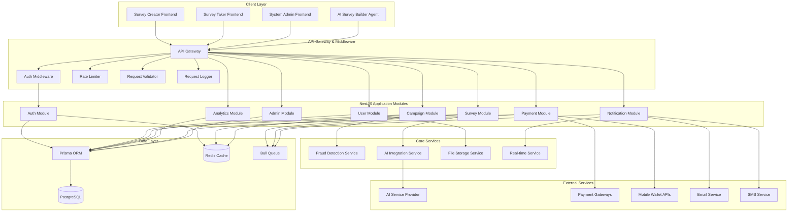

# Design Document: Scalable NestJS Backend

## Overview

The Scalable NestJS Backend is the comprehensive server-side architecture for the Vibe Survey platform - a Survey-as-Ads marketplace connecting advertisers, survey takers, and platform administrators. This backend serves as the central data layer and business logic engine for three distinct frontend applications (System Admin Dashboard, Survey Creator Frontend, Survey Taker Frontend) and an AI Survey Builder Agent.

The system implements a modular, domain-driven architecture using NestJS framework with PostgreSQL database, Prisma ORM, JWT authentication, and comprehensive security measures. It provides 200+ REST API endpoints, real-time capabilities via WebSocket and SSE, AI integration for survey generation, payment processing with mobile wallet integration, fraud detection, and advanced analytics.

### Key Design Goals

1. **Scalability**: Support high-traffic scenarios with horizontal scaling, caching, and efficient database queries
2. **Maintainability**: Clean architecture with clear separation of concerns and modular design
3. **Security**: Comprehensive authentication, authorization, input validation, and fraud prevention
4. **Performance**: Optimized data access with Redis caching, connection pooling, and background job processing
5. **Reliability**: Robust error handling, graceful degradation, and comprehensive monitoring
6. **Extensibility**: Plugin architecture for payment providers, notification channels, and external integrations

### Technology Stack

- **Framework**: NestJS with TypeScript (strict mode)
- **Database**: PostgreSQL with Prisma ORM
- **Authentication**: JWT tokens with bcrypt password hashing
- **Caching**: Redis for performance optimization
- **Queue System**: Bull for background job processing
- **Real-time**: WebSocket and Server-Sent Events (SSE)
- **Testing**: Jest with property-based testing for critical logic
- **Monitoring**: Winston logging, health checks, metrics export

## Architecture

### High-Level System Architecture




### Layered Architecture

The backend follows a strict layered architecture pattern:

```
┌─────────────────────────────────────────┐
│         Controller Layer                │
│  (HTTP Request Handling, Routing)       │
└─────────────────────────────────────────┘
                  ↓
┌─────────────────────────────────────────┐
│          Service Layer                  │
│  (Business Logic, Orchestration)        │
└─────────────────────────────────────────┘
                  ↓
┌─────────────────────────────────────────┐
│        Repository Layer                 │
│  (Data Access, Persistence)             │
└─────────────────────────────────────────┘
                  ↓
┌─────────────────────────────────────────┐
│         Database Layer                  │
│  (PostgreSQL via Prisma ORM)            │
└─────────────────────────────────────────┘
```

**Layer Responsibilities**:

1. **Controller Layer**: 
   - HTTP request/response handling
   - Route parameter extraction and validation
   - DTO transformation
   - Response formatting
   - Error handling delegation

2. **Service Layer**:
   - Business logic implementation
   - Transaction management
   - Service orchestration
   - External service integration
   - Event emission

3. **Repository Layer**:
   - Database query abstraction
   - Data mapping and transformation
   - Query optimization
   - Cache management

4. **Database Layer**:
   - Data persistence
   - Referential integrity
   - Transaction support
   - Query execution

### Module Organization

The application is organized into domain-specific modules following Domain-Driven Design principles:


```
backend/src/
├── app.module.ts                 # Root application module
├── main.ts                       # Application bootstrap
│
├── auth/                         # Authentication & Authorization Module
│   ├── auth.module.ts
│   ├── auth.controller.ts
│   ├── auth.service.ts
│   ├── strategies/               # Passport strategies
│   │   ├── jwt.strategy.ts
│   │   ├── refresh-token.strategy.ts
│   │   └── oauth.strategy.ts
│   ├── guards/
│   │   ├── jwt-auth.guard.ts
│   │   ├── roles.guard.ts
│   │   └── permissions.guard.ts
│   ├── decorators/
│   │   ├── current-user.decorator.ts
│   │   ├── roles.decorator.ts
│   │   └── permissions.decorator.ts
│   └── dto/
│       ├── login.dto.ts
│       ├── register.dto.ts
│       └── refresh-token.dto.ts
│
├── users/                        # User Management Module
│   ├── users.module.ts
│   ├── users.controller.ts
│   ├── users.service.ts
│   ├── users.repository.ts
│   ├── dto/
│   │   ├── create-user.dto.ts
│   │   ├── update-user.dto.ts
│   │   └── user-profile.dto.ts
│   └── entities/
│       └── user.entity.ts
│
├── surveys/                      # Survey Management Module
│   ├── surveys.module.ts
│   ├── surveys.controller.ts
│   ├── surveys.service.ts
│   ├── surveys.repository.ts
│   ├── survey-validation.service.ts
│   ├── survey-versioning.service.ts
│   ├── survey-import-export.service.ts
│   ├── dto/
│   │   ├── create-survey.dto.ts
│   │   ├── update-survey.dto.ts
│   │   └── survey-response.dto.ts
│   ├── entities/
│   │   ├── survey.entity.ts
│   │   ├── question.entity.ts
│   │   └── survey-version.entity.ts
│   └── schemas/
│       └── survey-canonical.schema.ts
│
├── campaigns/                    # Campaign Management Module
│   ├── campaigns.module.ts
│   ├── campaigns.controller.ts
│   ├── campaigns.service.ts
│   ├── campaigns.repository.ts
│   ├── targeting.service.ts
│   ├── budget.service.ts
│   ├── dto/
│   │   ├── create-campaign.dto.ts
│   │   ├── update-campaign.dto.ts
│   │   └── targeting-criteria.dto.ts
│   └── entities/
│       ├── campaign.entity.ts
│       └── targeting.entity.ts
│
├── analytics/                    # Analytics & Reporting Module
│   ├── analytics.module.ts
│   ├── analytics.controller.ts
│   ├── analytics.service.ts
│   ├── analytics.repository.ts
│   ├── reporting.service.ts
│   ├── aggregation.service.ts
│   └── dto/
│       ├── analytics-query.dto.ts
│       └── report-config.dto.ts
│
├── payments/                     # Payment Processing Module
│   ├── payments.module.ts
│   ├── payments.controller.ts
│   ├── payments.service.ts
│   ├── payments.repository.ts
│   ├── wallet.service.ts
│   ├── payout.service.ts
│   ├── providers/
│   │   ├── aba-pay.provider.ts
│   │   ├── wing.provider.ts
│   │   └── true-money.provider.ts
│   ├── dto/
│   │   ├── withdrawal-request.dto.ts
│   │   └── transaction.dto.ts
│   └── entities/
│       ├── transaction.entity.ts
│       └── wallet.entity.ts
│
├── admin/                        # Admin Management Module
│   ├── admin.module.ts
│   ├── admin.controller.ts
│   ├── admin.service.ts
│   ├── moderation.service.ts
│   ├── approval-workflow.service.ts
│   └── dto/
│       ├── campaign-review.dto.ts
│       └── user-moderation.dto.ts
│
├── fraud-detection/              # Fraud Detection Module
│   ├── fraud-detection.module.ts
│   ├── fraud-detection.service.ts
│   ├── behavioral-analysis.service.ts
│   ├── pattern-detection.service.ts
│   └── dto/
│       └── fraud-analysis.dto.ts
│
├── ai-integration/               # AI Integration Module
│   ├── ai-integration.module.ts
│   ├── ai-integration.service.ts
│   ├── prompt-validation.service.ts
│   ├── ai-cache.service.ts
│   └── dto/
│       ├── ai-prompt.dto.ts
│       └── ai-response.dto.ts
│
├── notifications/                # Notification Module
│   ├── notifications.module.ts
│   ├── notifications.controller.ts
│   ├── notifications.service.ts
│   ├── channels/
│   │   ├── email.channel.ts
│   │   ├── sms.channel.ts
│   │   ├── push.channel.ts
│   │   └── in-app.channel.ts
│   └── dto/
│       └── notification.dto.ts
│
├── realtime/                     # Real-time Communication Module
│   ├── realtime.module.ts
│   ├── realtime.gateway.ts
│   ├── sse.controller.ts
│   └── connection-manager.service.ts
│
├── files/                        # File Management Module
│   ├── files.module.ts
│   ├── files.controller.ts
│   ├── files.service.ts
│   ├── storage/
│   │   ├── local.storage.ts
│   │   ├── s3.storage.ts
│   │   └── r2.storage.ts
│   └── dto/
│       └── file-upload.dto.ts
│
├── jobs/                         # Background Jobs Module
│   ├── jobs.module.ts
│   ├── processors/
│   │   ├── survey-import.processor.ts
│   │   ├── analytics.processor.ts
│   │   ├── payout.processor.ts
│   │   └── notification.processor.ts
│   └── dto/
│       └── job-status.dto.ts
│
├── common/                       # Shared Common Module
│   ├── common.module.ts
│   ├── guards/
│   │   ├── throttle.guard.ts
│   │   └── api-key.guard.ts
│   ├── interceptors/
│   │   ├── logging.interceptor.ts
│   │   ├── cache.interceptor.ts
│   │   ├── transform.interceptor.ts
│   │   └── timeout.interceptor.ts
│   ├── pipes/
│   │   ├── validation.pipe.ts
│   │   └── parse-object-id.pipe.ts
│   ├── filters/
│   │   ├── http-exception.filter.ts
│   │   └── all-exceptions.filter.ts
│   ├── decorators/
│   │   ├── api-paginated-response.decorator.ts
│   │   └── public.decorator.ts
│   ├── dto/
│   │   ├── pagination.dto.ts
│   │   └── api-response.dto.ts
│   ├── interfaces/
│   │   ├── paginated-result.interface.ts
│   │   └── api-response.interface.ts
│   └── utils/
│       ├── encryption.util.ts
│       ├── validation.util.ts
│       └── date.util.ts
│
├── config/                       # Configuration Module
│   ├── config.module.ts
│   ├── configuration.ts
│   ├── validation.schema.ts
│   └── env/
│       ├── database.config.ts
│       ├── redis.config.ts
│       ├── jwt.config.ts
│       └── app.config.ts
│
└── database/                     # Database Module
    ├── database.module.ts
    ├── prisma.service.ts
    └── migrations/
```

### Cross-Cutting Concerns

The architecture implements several cross-cutting concerns through NestJS interceptors, guards, and pipes:

1. **Authentication & Authorization**:
   - JWT authentication guard on protected routes
   - Role-based access control (RBAC) guard
   - Permission-based authorization guard

2. **Request Validation**:
   - Global validation pipe with class-validator
   - Custom validation rules for business logic
   - Sanitization for security

3. **Logging & Monitoring**:
   - Request/response logging interceptor
   - Performance monitoring interceptor
   - Error tracking and alerting

4. **Caching**:
   - Redis-based cache interceptor
   - Cache invalidation strategies
   - TTL management

5. **Rate Limiting**:
   - Throttle guard with Redis backend
   - Role-based rate limits
   - Endpoint-specific limits

6. **Error Handling**:
   - Global exception filter
   - Standardized error responses
   - Error logging and tracking

## Components and Interfaces

### 1. Authentication Module

**Purpose**: Provides secure authentication and authorization for all API endpoints with support for multiple authentication methods.

**Key Components**:

