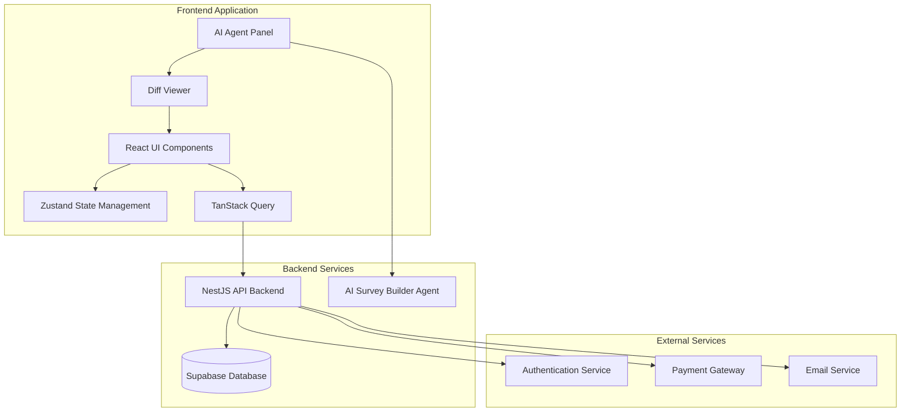
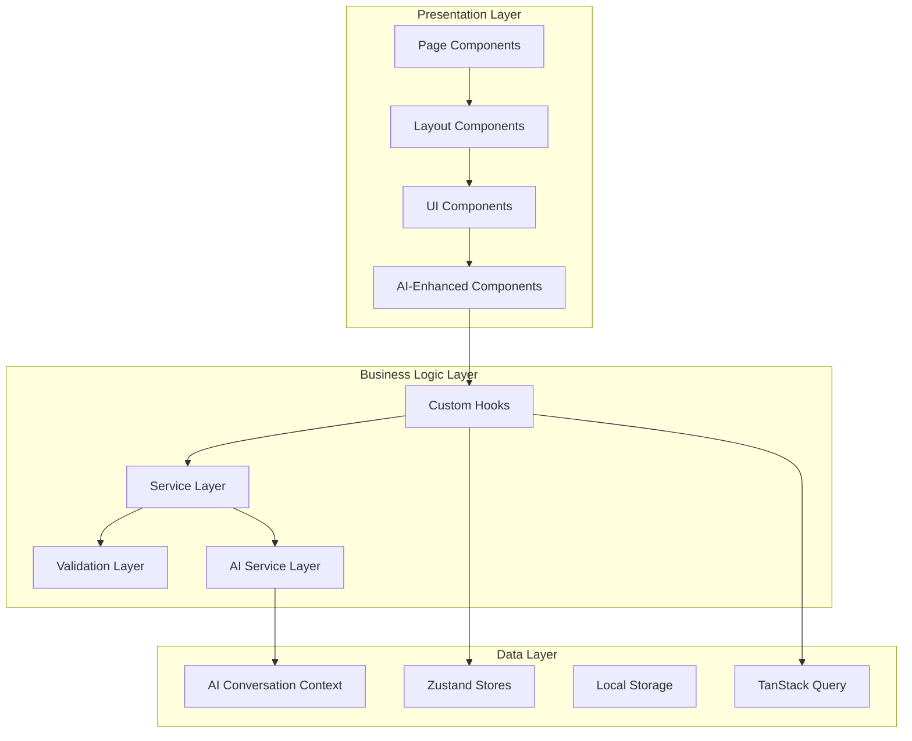
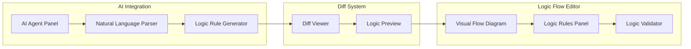
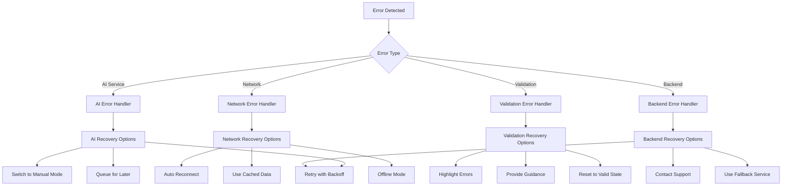
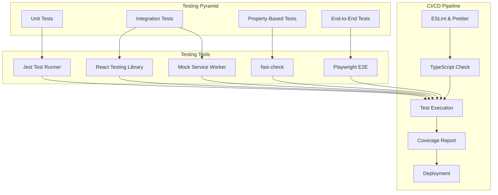

# Design Document: Survey Creator Frontend

## Overview

The Survey Creator Frontend is a React-based web application that provides advertisers with an intuitive interface for creating, managing, and analyzing survey campaigns. The system integrates deeply with an AI Survey Builder Agent to enable natural language survey creation, intelligent content normalization, and automated enhancements while maintaining full user control through a diff-based preview system.

The frontend operates as part of a three-sided marketplace platform, connecting advertisers who want to collect feedback, users who respond to surveys, and the platform that facilitates these interactions. The application emphasizes AI-assisted workflow optimization while preserving advertiser autonomy over survey content and campaign parameters.

Key architectural principles include:
- **AI-First Design**: Natural language interfaces integrated throughout the survey creation workflow
- **Diff-Based Control**: All AI modifications presented for review before application
- **Real-Time Collaboration**: Live updates and multi-user editing capabilities
- **Progressive Enhancement**: Manual editing capabilities enhanced by AI assistance
- **Security-First**: Comprehensive validation and prompt injection prevention

## Architecture

### High-Level Architecture



### Component Architecture

The application follows a modular component architecture with clear separation between presentation, business logic, and data management:



### Technology Stack

- **Frontend Framework**: React 19 with TypeScript (Next.js 16 App Router)
- **Build Tool**: Next.js 16 with App Router for SSR and optimized builds
- **Styling**: Tailwind CSS with shadcn/ui component library
- **State Management**: 
  - Zustand for client-side state (UI state, AI conversation context)
  - TanStack Query for server state management and caching
- **Validation**: Zod for runtime type validation and schema enforcement
- **AI Integration**: Custom hooks and services for AI agent communication
- **Real-Time Updates**: WebSocket connections for live collaboration and updates

## Components and Interfaces

### Core Application Components

#### 1. Campaign Wizard Component
**Purpose**: Guides advertisers through the campaign creation process with integrated AI assistance.

**Key Features**:
- Multi-step wizard with progress tracking
- Draft auto-save functionality
- AI-powered template suggestions
- Validation at each step

**Interface**:
```typescript
interface CampaignWizardProps {
  campaignId?: string;
  onComplete: (campaign: Campaign) => void;
  onSave: (draft: CampaignDraft) => void;
}

interface CampaignStep {
  id: string;
  title: string;
  component: React.ComponentType;
  validation: ZodSchema;
  aiAssistance?: boolean;
}
```

#### 2. AI-Enhanced Survey Builder
**Purpose**: Provides drag-and-drop survey creation with integrated AI assistance for natural language modifications.

**Key Features**:
- Visual question management with drag-and-drop reordering
- Real-time AI integration through AI_Agent_Panel
- Question type support for all specified formats
- Automatic completion time estimation

**Interface**:
```typescript
interface SurveyBuilderProps {
  survey: Survey;
  onSurveyChange: (survey: Survey) => void;
  aiEnabled: boolean;
  collaborators?: User[];
}

interface Question {
  id: string;
  type: QuestionType;
  title: string;
  description?: string;
  required: boolean;
  options?: QuestionOption[];
  validation?: ValidationRule[];
  aiGenerated?: boolean;
}
```

#### 3. AI-Enhanced Logic Flow Editor
**Purpose**: Provides visual and natural language interfaces for creating complex survey logic flows.

**Key Features**:
- Visual flow diagram with conditional paths
- Natural language logic creation through AI integration
- Skip logic, branching logic, and quota-based routing
- Circular logic detection and validation
- AI-powered logic improvement suggestions

**Interface**:
```typescript
interface LogicFlowEditorProps {
  survey: Survey;
  onLogicChange: (logic: LogicRule[]) => void;
  aiEnabled: boolean;
}

interface LogicRule {
  id: string;
  type: 'skip' | 'branch' | 'quota';
  sourceQuestionId: string;
  condition: LogicCondition;
  targetQuestionId?: string;
  action: LogicAction;
  aiGenerated?: boolean;
}

interface LogicCondition {
  operator: 'equals' | 'not_equals' | 'contains' | 'greater_than' | 'less_than';
  value: any;
  demographic?: DemographicFilter;
}
```

The Logic Flow Editor integrates tightly with the AI Agent Panel to enable natural language logic creation:



#### 4. AI Agent Panel
**Purpose**: Provides conversational interface for natural language survey creation and modification.

**Key Features**:
- Chat interface with conversation history
- Mode-specific AI interactions (Generate, Enhance, Normalize, Translate, Analyze, Modify)
- Real-time processing indicators
- Security validation for prompt injection prevention

**Interface**:
```typescript
interface AIAgentPanelProps {
  mode: AIAgentMode;
  conversationContext: ConversationContext;
  onModeChange: (mode: AIAgentMode) => void;
  onPromptSubmit: (prompt: string) => void;
  rateLimitInfo: RateLimitInfo;
}

interface ConversationContext {
  sessionId: string;
  messages: ChatMessage[];
  surveyContext: Survey;
  lastModification?: AIAction;
}

type AIAgentMode = 'Generate' | 'Enhance' | 'Normalize' | 'Translate' | 'Analyze' | 'Modify';
```

#### 5. Diff Viewer Component
**Purpose**: Displays side-by-side comparisons of AI-proposed changes before application.

**Key Features**:
- Visual diff highlighting for additions, deletions, and modifications
- Granular change acceptance/rejection
- Change summary statistics
- Keyboard navigation support

**Interface**:
```typescript
interface DiffViewerProps {
  original: Survey;
  proposed: Survey;
  changes: AIAction[];
  onAcceptChange: (changeId: string) => void;
  onRejectChange: (changeId: string) => void;
  onAcceptAll: () => void;
  onRejectAll: () => void;
}

interface AIAction {
  id: string;
  type: 'add_question' | 'update_question' | 'delete_question' | 'add_logic' | 'update_logic' | 'delete_logic';
  target: string;
  data: any;
  mode: AIAgentMode;
  timestamp: Date;
}
```

#### 6. Analytics Dashboard
**Purpose**: Provides comprehensive campaign performance metrics and response analysis.

**Key Features**:
- Real-time metrics with 30-second refresh intervals
- Demographic breakdown and cross-tabulation
- AI-powered sentiment analysis for text responses
- Interactive filtering and drill-down capabilities

**Interface**:
```typescript
interface AnalyticsDashboardProps {
  campaignId: string;
  dateRange: DateRange;
  filters: AnalyticsFilter[];
}

interface AnalyticsMetrics {
  totalResponses: number;
  qualifiedResponses: number;
  completionRate: number;
  averageCompletionTime: number;
  fraudScore: FraudScoreDistribution;
  costPerResponse: number;
  demographicBreakdown: DemographicData;
}
```

### AI-Specific Components

#### 1. Import Wizard with AI Normalization
**Purpose**: Handles Excel file imports with AI-powered data normalization and standardization.

**Key Features**:
- File upload and parsing
- AI normalization for inconsistent formatting
- Preview and approval workflow
- Error handling and retry mechanisms

#### 2. Export Panel
**Purpose**: Provides multi-format export capabilities (Excel, PDF, JSON) with format-specific configurations.

#### 3. Template Gallery
**Purpose**: AI-powered template suggestions and modifications based on campaign objectives.

#### 4. Version History Panel
**Purpose**: Tracks all changes including AI-generated modifications with rollback capabilities.

## Data Models

### Core Survey Data Model

```typescript
interface Survey {
  id: string;
  campaignId: string;
  title: string;
  description?: string;
  questions: Question[];
  logic: LogicRule[];
  screener: ScreenerQuestion[];
  settings: SurveySettings;
  metadata: SurveyMetadata;
  version: number;
  createdAt: Date;
  updatedAt: Date;
}

interface SurveySettings {
  randomizeQuestions: boolean;
  randomizeAnswers: boolean;
  allowBackNavigation: boolean;
  showProgressBar: boolean;
  estimatedCompletionTime: number;
  maxResponseTime?: number;
}

interface SurveyMetadata {
  createdBy: string;
  lastModifiedBy: string;
  aiModifications: AIAction[];
  collaborators: string[];
  tags: string[];
}
```

### AI Integration Data Models

```typescript
interface AIRequest {
  sessionId: string;
  mode: AIAgentMode;
  prompt: string;
  context: ConversationContext;
  surveyState: Survey;
  timestamp: Date;
}

interface AIResponse {
  requestId: string;
  actions: AIAction[];
  explanation: string;
  confidence: number;
  warnings?: string[];
  errors?: string[];
}

interface RateLimitInfo {
  requestsRemaining: number;
  resetTime: Date;
  dailyLimit: number;
  currentUsage: number;
}
```

### Campaign and Analytics Data Models

```typescript
interface Campaign {
  id: string;
  advertiserId: string;
  name: string;
  objective: CampaignObjective;
  survey: Survey;
  targeting: AudienceTargeting;
  budget: BudgetSettings;
  status: CampaignStatus;
  analytics: CampaignAnalytics;
  createdAt: Date;
  updatedAt: Date;
}

interface AudienceTargeting {
  demographics: DemographicFilter[];
  interests: InterestFilter[];
  behaviors: BehaviorFilter[];
  customScreeners: ScreenerQuestion[];
  estimatedReach: AudienceEstimate;
}

interface BudgetSettings {
  totalBudget: number;
  dailyCap?: number;
  costPerResponse: number;
  segmentQuotas: SegmentQuota[];
  spentAmount: number;
  remainingBudget: number;
}
```

## Correctness Properties

*A property is a characteristic or behavior that should hold true across all valid executions of a system-essentially, a formal statement about what the system should do. Properties serve as the bridge between human-readable specifications and machine-verifiable correctness guarantees.*

Based on the prework analysis, the following properties have been identified as suitable for property-based testing:

### Property 1: Registration Form Submission Creates Pending Account

*For any* valid registration data (advertiser name, email, phone, address, documentation), submitting the registration form should create an account in pending status with all provided information correctly stored.

**Validates: Requirements 1.1**

### Property 2: Document Upload Triggers Admin Review

*For any* valid verification document, uploading the document should store it successfully and flag the account for admin review with appropriate metadata.

**Validates: Requirements 1.2**

### Property 3: Wizard Step Completion Enables Navigation

*For any* valid step data in the campaign wizard, completing a step should save the data as a draft and enable navigation to the next step while preserving all previously entered data.

**Validates: Requirements 2.2**

### Property 4: AI Prompt Processing Pipeline

*For any* valid natural language prompt submitted to the AI Agent Panel, the system should generate survey modifications and display them in the Diff Viewer with appropriate change tracking.

**Validates: Requirements 4.4**

### Property 5: Natural Language Logic Rule Generation

*For any* valid natural language logic description, the AI Agent Panel should generate appropriate logic rules and display them in the Diff Viewer with correct rule structure and targeting.

**Validates: Requirements 5.6**

### Property 6: Logic Rule Target Validation

*For any* logic rule that references existing questions, the Logic Flow Editor should validate that target questions exist and allow rule creation, while rejecting rules that reference non-existent questions.

**Validates: Requirements 5.7**

### Property 7: Circular Logic Detection

*For any* set of logic rules that creates circular dependencies, the Logic Flow Editor should detect the circular paths and display appropriate warnings to prevent infinite loops.

**Validates: Requirements 5.8**

### Property 8: Completion Rate Calculation Accuracy

*For any* set of survey response data with started and completed responses, the Analytics Dashboard should calculate the completion rate as an accurate percentage (completed/started * 100).

**Validates: Requirements 10.2**

### Property 9: Change Management Operations

*For any* set of AI-proposed changes displayed in the Diff Viewer, accepting or rejecting individual changes should correctly apply or ignore those specific modifications while preserving the state of other changes.

**Validates: Requirements 19.5**

### Property 10: Response Data Round-Trip Integrity

*For any* valid Response object, parsing the object to JSON then parsing back to a Response object should produce an equivalent object with all data preserved.

**Validates: Requirements 28.5**

## Error Handling

### AI-Specific Error Handling

The application implements comprehensive error handling for AI operations with graceful degradation and recovery options:

#### 1. AI Service Unavailability
- **Detection**: Monitor AI service health through heartbeat endpoints
- **Response**: Display service status indicator and queue non-critical requests
- **Recovery**: Automatic retry with exponential backoff, fallback to manual editing mode

#### 2. Rate Limit Exceeded
- **Detection**: Monitor rate limit headers and track request quotas
- **Response**: Display remaining quota and reset time to users
- **Recovery**: Queue requests until limits reset, suggest manual alternatives

#### 3. Prompt Injection Detection
- **Detection**: Client-side validation using Security_Guard component
- **Response**: Block malicious prompts and display security warnings
- **Recovery**: Suggest alternative phrasing, log incidents for monitoring

#### 4. AI Processing Failures
- **Detection**: Monitor AI request timeouts and error responses
- **Response**: Display specific error messages with context
- **Recovery**: Offer retry options, suggest manual editing alternatives

### General Application Error Handling

#### 1. Network Connectivity Issues
- **Detection**: Monitor network status and API response patterns
- **Response**: Display offline indicators and cache critical data locally
- **Recovery**: Automatic reconnection attempts, sync queued operations

#### 2. Authentication Failures
- **Detection**: Monitor 401/403 responses from API endpoints
- **Response**: Redirect to login with session preservation
- **Recovery**: Restore user session and continue from last state

#### 3. Data Validation Errors
- **Detection**: Zod schema validation on all user inputs
- **Response**: Display field-specific error messages with correction guidance
- **Recovery**: Highlight invalid fields, provide format examples

#### 4. Backend Service Errors
- **Detection**: Monitor 5xx responses and service health
- **Response**: Display user-friendly error messages with support contact
- **Recovery**: Automatic retry for transient errors, escalation for persistent issues

### Error Recovery Strategies



## Testing Strategy

### Dual Testing Approach

The Survey Creator Frontend employs a comprehensive testing strategy combining unit tests for specific scenarios and property-based tests for universal behaviors:

#### Unit Testing Strategy
- **Component Testing**: React Testing Library for UI component behavior
- **Integration Testing**: Mock Service Worker (MSW) for API integration testing
- **AI Integration Testing**: Mock AI responses for predictable testing scenarios
- **Accessibility Testing**: Automated WCAG 2.1 Level AA compliance verification
- **Visual Regression Testing**: Snapshot testing for UI consistency

#### Property-Based Testing Strategy
- **Library**: fast-check for JavaScript/TypeScript property-based testing
- **Configuration**: Minimum 100 iterations per property test
- **Coverage**: All identified correctness properties from the design document
- **Tagging**: Each property test tagged with feature name and property reference

**Property Test Configuration Example**:
```typescript
// Feature: survey-creator-frontend, Property 1: Registration Form Submission Creates Pending Account
describe('Registration System Properties', () => {
  it('should create pending account for any valid registration data', () => {
    fc.assert(fc.property(
      validRegistrationDataArbitrary(),
      (registrationData) => {
        const result = submitRegistrationForm(registrationData);
        expect(result.status).toBe('pending');
        expect(result.data).toMatchObject(registrationData);
      }
    ), { numRuns: 100 });
  });
});
```

#### AI-Specific Testing Considerations
- **Mock AI Responses**: Deterministic AI responses for consistent testing
- **Conversation Context Testing**: Verify context preservation across sessions
- **Diff Viewer Testing**: Validate change detection and application logic
- **Security Testing**: Prompt injection prevention and input sanitization
- **Rate Limiting Testing**: Quota management and limit enforcement

#### Performance Testing
- **Load Testing**: Simulate concurrent users creating surveys
- **AI Performance Testing**: Monitor AI request latency and throughput
- **Real-Time Update Testing**: WebSocket connection stability under load
- **Memory Leak Testing**: Long-running session stability

#### End-to-End Testing
- **User Journey Testing**: Complete campaign creation workflows
- **AI Integration Testing**: Full AI-assisted survey creation scenarios
- **Cross-Browser Testing**: Compatibility across modern browsers
- **Mobile Responsiveness Testing**: Touch interface and responsive design

### Testing Infrastructure



### Quality Assurance Metrics

- **Code Coverage**: Minimum 80% line coverage, 90% for critical AI integration paths
- **Property Test Coverage**: 100% of identified correctness properties implemented
- **Performance Benchmarks**: 
  - Initial page load < 2 seconds
  - AI response time < 5 seconds for simple operations
  - Real-time updates < 500ms latency
- **Accessibility Compliance**: WCAG 2.1 Level AA automated and manual testing
- **Security Testing**: Regular penetration testing and prompt injection validation

This comprehensive testing strategy ensures the Survey Creator Frontend maintains high quality, reliability, and security while providing seamless AI-enhanced survey creation capabilities.