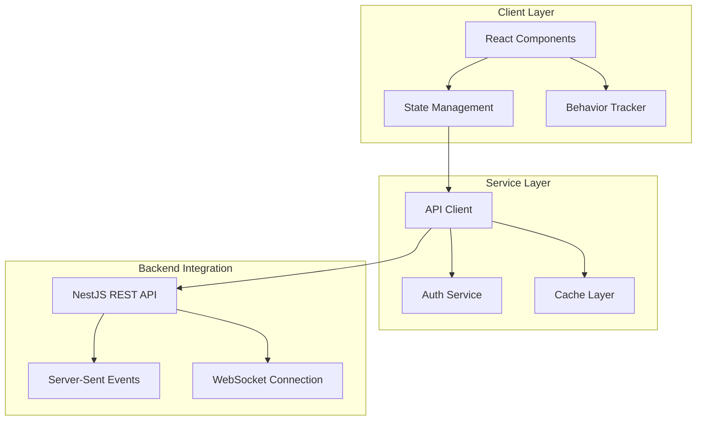

# Design Document: Survey Taker Frontend

## Overview

The Survey Taker Frontend is a React-based web application that serves as the primary user interface for a Survey-as-Ads platform. This mobile-first application enables users to discover, complete surveys, and earn monetary rewards while implementing sophisticated fraud detection through behavioral analysis.

### Key Features

- **Mobile-First Design**: Responsive interface optimized for mobile devices with touch-friendly interactions
- **Bilingual Support**: Full Khmer/English localization with dynamic language switching
- **Survey Engine**: Advanced survey rendering with multiple question types, branching logic, and auto-save
- **Fraud Detection**: Comprehensive behavioral tracking and analysis to ensure response quality
- **Reward Management**: Points-based system with local payment integration (ABA Pay, WING, TrueMoney)
- **Real-time Features**: Push notifications, live updates, and offline capabilities
- **Trust System**: User reputation management with tier-based benefits

### Technology Stack

- **Framework**: Next.js 16 with App Router
- **Language**: TypeScript for type safety
- **Styling**: Tailwind CSS for responsive design
- **State Management**: Zustand for client state, TanStack Query for server state
- **Forms**: React Hook Form with Zod validation
- **Internationalization**: next-intl for bilingual support
- **Authentication**: JWT with httpOnly cookies
- **Real-time**: Server-Sent Events (SSE) for notifications
- **Offline**: Service Worker with background sync
- **Testing**: Vitest for unit tests, Playwright for E2E

## Architecture

### High-Level Architecture



### Component Architecture

The application follows a layered component architecture:

1. **Page Components**: Route-level components handling layout and data fetching
2. **Feature Components**: Business logic components (Survey Engine, Rewards Wallet)
3. **UI Components**: Reusable interface elements with consistent styling
4. **Layout Components**: Navigation, headers, and structural elements

### State Management Strategy

**Client State (Zustand)**:
- User preferences (language, theme)
- UI state (modals, loading states)
- Survey progress and responses
- Behavioral tracking data

**Server State (TanStack Query)**:
- User profile and authentication
- Survey data and history
- Rewards and transaction data
- Notifications and system updates

**Form State (React Hook Form)**:
- Registration and profile forms
- Survey responses
- Withdrawal requests

## Components and Interfaces

### Core Components

#### 1. Authentication System

**AuthProvider Component**
```typescript
interface AuthContextType {
  user: User | null;
  login: (credentials: LoginCredentials) => Promise<void>;
  logout: () => void;
  register: (data: RegistrationData) => Promise<void>;
  verifyPhone: (otp: string) => Promise<void>;
  isAuthenticated: boolean;
  isLoading: boolean;
}
```

**Key Features**:
- JWT token management with automatic refresh
- Device fingerprinting integration
- Multi-provider OAuth support (Google, Facebook)
- Phone verification flow with OTP

#### 2. Survey Engine

**SurveyEngine Component**
```typescript
interface SurveyEngineProps {
  surveyId: string;
  onComplete: (responses: SurveyResponse[]) => void;
  onProgress: (progress: SurveyProgress) => void;
}

interface SurveyResponse {
  questionId: string;
  answer: any;
  responseTime: number;
  behavioralData: BehavioralSignals;
}
```

**Question Types Supported**:
- Multiple choice (single/multi-select)
- Text input (short/long form)
- Numeric input with validation
- Rating scales (Likert, star ratings)
- Matrix questions
- Ranking questions
- File upload (images)

**Key Features**:
- Progressive rendering with lazy loading
- Branching logic engine
- Auto-save every 30 seconds
- Attention check integration
- Honeypot question support

#### 3. Behavioral Tracking System

**BehaviorTracker Component**
```typescript
interface BehavioralSignals {
  responseTime: number;
  mouseMovements: MouseEvent[];
  scrollEvents: ScrollEvent[];
  clickPatterns: ClickEvent[];
  focusEvents: FocusEvent[];
  interactionDepth: InteractionMetrics;
}

interface InteractionMetrics {
  totalMouseDistance: number;
  uniqueMousePositions: number;
  scrollDistance: number;
  focusLossCount: number;
  focusLossDuration: number;
}
```

**Tracking Capabilities**:
- Response time analysis per question
- Mouse movement and click pattern detection
- Scroll behavior monitoring
- Window focus/blur tracking
- Interaction depth measurement

#### 4. Rewards System

**RewardsWallet Component**
```typescript
interface WalletData {
  approvedPoints: number;
  pendingPoints: number;
  lifetimeEarnings: number;
  transactions: Transaction[];
  withdrawalThreshold: number;
}

interface WithdrawalRequest {
  amount: number;
  provider: PaymentProvider;
  accountNumber: string;
  fees: number;
}
```

**Payment Providers**:
- ABA Pay
- WING
- TrueMoney
- Bank Transfer

#### 5. Notification System

**NotificationCenter Component**
```typescript
interface Notification {
  id: string;
  type: NotificationType;
  title: string;
  message: string;
  timestamp: Date;
  isRead: boolean;
  actionUrl?: string;
}

enum NotificationType {
  NEW_SURVEY = 'new_survey',
  POINTS_APPROVED = 'points_approved',
  PAYOUT_COMPLETED = 'payout_completed',
  TRUST_TIER_CHANGED = 'trust_tier_changed'
}
```

### API Integration Patterns

#### HTTP Client Configuration

```typescript
// API client with interceptors
const apiClient = axios.create({
  baseURL: process.env.NEXT_PUBLIC_API_URL,
  timeout: 10000,
  withCredentials: true
});

// Request interceptor for authentication
apiClient.interceptors.request.use((config) => {
  const token = getAuthToken();
  if (token) {
    config.headers.Authorization = `Bearer ${token}`;
  }
  return config;
});

// Response interceptor for token refresh
apiClient.interceptors.response.use(
  (response) => response,
  async (error) => {
    if (error.response?.status === 401) {
      await refreshToken();
      return apiClient.request(error.config);
    }
    return Promise.reject(error);
  }
);
```

#### TanStack Query Integration

```typescript
// Survey data queries
export const useSurveyFeed = (filters: SurveyFilters) => {
  return useInfiniteQuery({
    queryKey: ['surveys', filters],
    queryFn: ({ pageParam = 0 }) => 
      fetchSurveys({ ...filters, page: pageParam }),
    getNextPageParam: (lastPage) => lastPage.nextPage,
    staleTime: 5 * 60 * 1000, // 5 minutes
  });
};

// Mutation for survey submission
export const useSubmitSurvey = () => {
  const queryClient = useQueryClient();
  
  return useMutation({
    mutationFn: submitSurveyResponse,
    onSuccess: () => {
      queryClient.invalidateQueries(['surveys']);
      queryClient.invalidateQueries(['wallet']);
    },
  });
};
```

## Data Models

### User Models

```typescript
interface User {
  id: string;
  email: string;
  phone: string;
  profile: UserProfile;
  trustTier: TrustTier;
  isVerified: boolean;
  createdAt: Date;
  lastLoginAt: Date;
}

interface UserProfile {
  firstName: string;
  lastName: string;
  age: number;
  gender: Gender;
  location: Location;
  education: EducationLevel;
  employment: EmploymentStatus;
  incomeRange: IncomeRange;
  interests: Interest[];
  completeness: number; // 0-100%
}

interface TrustTier {
  level: 'Bronze' | 'Silver' | 'Gold' | 'Platinum';
  benefits: TierBenefits;
  requirements: TierRequirements;
  progress: number; // 0-100%
}
```

### Survey Models

```typescript
interface Survey {
  id: string;
  title: string;
  description: string;
  estimatedTime: number; // minutes
  rewardPoints: number;
  matchScore: number; // 0-100%
  category: SurveyCategory;
  ageRestriction?: number;
  screener?: Screener;
  questions: Question[];
  branchingLogic: BranchingRule[];
}

interface Question {
  id: string;
  type: QuestionType;
  text: string;
  options?: Option[];
  validation: ValidationRule[];
  isRequired: boolean;
  isAttentionCheck: boolean;
  isHoneypot: boolean;
}

interface BranchingRule {
  questionId: string;
  condition: Condition;
  targetQuestionId: string;
  action: 'show' | 'hide' | 'skip';
}
```

### Fraud Detection Models

```typescript
interface FraudAnalysis {
  surveyResponseId: string;
  behavioralSignals: BehavioralSignals;
  fraudConfidenceScore: number; // 0-100
  qualityLabel: QualityLabel;
  flaggedSignals: FlaggedSignal[];
  calculatedAt: Date;
}

enum QualityLabel {
  HIGH_QUALITY = 'High Quality',
  SUSPICIOUS = 'Suspicious',
  LIKELY_FRAUD = 'Likely Fraud'
}

interface FlaggedSignal {
  type: SignalType;
  value: number;
  threshold: number;
  weight: number;
  description: string;
}

enum SignalType {
  RESPONSE_TIME = 'response_time',
  CLICK_PATTERN = 'click_pattern',
  ANSWER_PATTERN = 'answer_pattern',
  INTERACTION_DEPTH = 'interaction_depth',
  ATTENTION_CHECK = 'attention_check',
  HONEYPOT = 'honeypot'
}
```

## Mobile-First Responsive Design

### Breakpoint Strategy

```typescript
// Tailwind CSS breakpoints
const breakpoints = {
  sm: '640px',   // Small devices
  md: '768px',   // Tablets
  lg: '1024px',  // Laptops
  xl: '1280px',  // Desktops
  '2xl': '1536px' // Large screens
};
```

### Touch-Friendly Interface

- **Minimum tap targets**: 44px × 44px
- **Gesture support**: Swipe navigation for surveys
- **Keyboard optimization**: Appropriate input types for mobile
- **Zoom prevention**: Prevent zoom on form inputs while maintaining accessibility

### Progressive Enhancement

1. **Core functionality**: Works without JavaScript
2. **Enhanced experience**: Rich interactions with JavaScript
3. **Offline capability**: Service Worker for basic functionality
4. **Performance**: Code splitting and lazy loading

## Fraud Detection Implementation

### Behavioral Data Collection

The fraud detection system operates through comprehensive behavioral tracking:

#### Response Time Analysis
```typescript
class ResponseTimeTracker {
  private questionStartTime: number = 0;
  
  startQuestion(questionId: string): void {
    this.questionStartTime = performance.now();
  }
  
  recordResponse(questionId: string, answer: any): BehavioralSignal {
    const responseTime = performance.now() - this.questionStartTime;
    
    return {
      questionId,
      responseTime,
      isBelowHumanThreshold: responseTime < 500,
      timestamp: new Date()
    };
  }
}
```

#### Click Pattern Detection
```typescript
class ClickPatternAnalyzer {
  private clickEvents: ClickEvent[] = [];
  
  recordClick(event: MouseEvent): void {
    this.clickEvents.push({
      timestamp: performance.now(),
      x: event.clientX,
      y: event.clientY,
      target: event.target
    });
  }
  
  analyzePattern(): ClickPatternAnalysis {
    const intervals = this.calculateIntervals();
    const standardDeviation = this.calculateStandardDeviation(intervals);
    
    return {
      uniformPattern: standardDeviation < 50,
      rapidClicks: intervals.some(interval => interval < 200),
      averageInterval: intervals.reduce((a, b) => a + b, 0) / intervals.length
    };
  }
}
```

### Fraud Score Calculation

```typescript
class FraudScoreCalculator {
  private weights = {
    responseTime: 0.25,
    clickPattern: 0.20,
    answerPattern: 0.20,
    interactionDepth: 0.20,
    attentionCheck: 0.15
  };
  
  calculateScore(signals: BehavioralSignals): FraudAnalysis {
    const scores = {
      responseTime: this.analyzeResponseTime(signals.responseTime),
      clickPattern: this.analyzeClickPattern(signals.clickPatterns),
      answerPattern: this.analyzeAnswerPattern(signals.answers),
      interactionDepth: this.analyzeInteractionDepth(signals.interactions),
      attentionCheck: this.analyzeAttentionChecks(signals.attentionChecks)
    };
    
    const weightedScore = Object.entries(scores).reduce(
      (total, [key, score]) => total + (score * this.weights[key]),
      0
    );
    
    return {
      fraudConfidenceScore: Math.round(weightedScore),
      qualityLabel: this.assignQualityLabel(weightedScore),
      flaggedSignals: this.identifyFlaggedSignals(scores)
    };
  }
}
```

## Real-time Features

### Server-Sent Events for Notifications

```typescript
class NotificationService {
  private eventSource: EventSource | null = null;
  
  connect(): void {
    this.eventSource = new EventSource('/api/notifications/stream');
    
    this.eventSource.onmessage = (event) => {
      const notification = JSON.parse(event.data);
      this.handleNotification(notification);
    };
    
    this.eventSource.onerror = () => {
      // Implement exponential backoff reconnection
      setTimeout(() => this.connect(), this.getBackoffDelay());
    };
  }
  
  private handleNotification(notification: Notification): void {
    // Update notification store
    notificationStore.addNotification(notification);
    
    // Show browser notification if permission granted
    if (Notification.permission === 'granted') {
      new Notification(notification.title, {
        body: notification.message,
        icon: '/icon-192x192.png'
      });
    }
  }
}
```

### Auto-Save Implementation

```typescript
class AutoSaveManager {
  private saveQueue: Map<string, SurveyResponse> = new Map();
  private saveInterval: NodeJS.Timeout | null = null;
  
  startAutoSave(): void {
    this.saveInterval = setInterval(() => {
      this.processSaveQueue();
    }, 30000); // Save every 30 seconds
  }
  
  queueResponse(questionId: string, response: SurveyResponse): void {
    this.saveQueue.set(questionId, response);
  }
  
  private async processSaveQueue(): Promise<void> {
    if (this.saveQueue.size === 0) return;
    
    const responses = Array.from(this.saveQueue.values());
    this.saveQueue.clear();
    
    try {
      await this.saveSurveyProgress(responses);
      this.showSaveSuccess();
    } catch (error) {
      // Re-queue failed saves
      responses.forEach(response => 
        this.saveQueue.set(response.questionId, response)
      );
      this.showSaveError();
    }
  }
}
```

## Offline Capabilities

### Service Worker Strategy

```typescript
// Service Worker for offline functionality
self.addEventListener('fetch', (event) => {
  if (event.request.url.includes('/api/surveys/')) {
    event.respondWith(
      caches.match(event.request)
        .then(response => response || fetch(event.request))
        .catch(() => caches.match('/offline.html'))
    );
  }
});

// Background sync for survey responses
self.addEventListener('sync', (event) => {
  if (event.tag === 'survey-response') {
    event.waitUntil(syncSurveyResponses());
  }
});
```

### Offline Data Management

```typescript
class OfflineManager {
  private db: IDBDatabase;
  
  async storeOfflineResponse(response: SurveyResponse): Promise<void> {
    const transaction = this.db.transaction(['responses'], 'readwrite');
    const store = transaction.objectStore('responses');
    await store.add(response);
  }
  
  async syncWhenOnline(): Promise<void> {
    if (!navigator.onLine) return;
    
    const responses = await this.getOfflineResponses();
    
    for (const response of responses) {
      try {
        await this.submitResponse(response);
        await this.removeOfflineResponse(response.id);
      } catch (error) {
        console.error('Failed to sync response:', error);
      }
    }
  }
}
```

## Error Handling Strategy

### Error Boundary Implementation

```typescript
class SurveyErrorBoundary extends Component<Props, State> {
  constructor(props: Props) {
    super(props);
    this.state = { hasError: false, error: null };
  }
  
  static getDerivedStateFromError(error: Error): State {
    return { hasError: true, error };
  }
  
  componentDidCatch(error: Error, errorInfo: ErrorInfo): void {
    // Log error to monitoring service
    errorReportingService.captureException(error, {
      extra: errorInfo,
      tags: { component: 'SurveyEngine' }
    });
  }
  
  render() {
    if (this.state.hasError) {
      return (
        <ErrorFallback 
          error={this.state.error}
          onRetry={() => this.setState({ hasError: false, error: null })}
        />
      );
    }
    
    return this.props.children;
  }
}
```

### API Error Handling

```typescript
class ApiErrorHandler {
  static handle(error: AxiosError): UserFriendlyError {
    if (error.response?.status === 422) {
      return {
        type: 'validation',
        message: 'Please check your input and try again',
        fields: error.response.data.errors
      };
    }
    
    if (error.response?.status === 429) {
      return {
        type: 'rate_limit',
        message: 'Too many requests. Please wait a moment.',
        retryAfter: error.response.headers['retry-after']
      };
    }
    
    if (!error.response) {
      return {
        type: 'network',
        message: 'Connection problem. Please check your internet.',
        canRetry: true
      };
    }
    
    return {
      type: 'server',
      message: 'Something went wrong. Please try again.',
      canRetry: true
    };
  }
}
```

## Security Considerations

### Content Security Policy

```typescript
// Next.js security headers
const securityHeaders = [
  {
    key: 'Content-Security-Policy',
    value: `
      default-src 'self';
      script-src 'self' 'unsafe-eval' 'unsafe-inline';
      style-src 'self' 'unsafe-inline';
      img-src 'self' data: https:;
      connect-src 'self' ${process.env.NEXT_PUBLIC_API_URL};
      font-src 'self';
    `.replace(/\s{2,}/g, ' ').trim()
  },
  {
    key: 'X-Frame-Options',
    value: 'DENY'
  },
  {
    key: 'X-Content-Type-Options',
    value: 'nosniff'
  }
];
```

### Input Sanitization

```typescript
import DOMPurify from 'dompurify';

class InputSanitizer {
  static sanitizeHtml(input: string): string {
    return DOMPurify.sanitize(input, {
      ALLOWED_TAGS: ['b', 'i', 'em', 'strong'],
      ALLOWED_ATTR: []
    });
  }
  
  static sanitizeText(input: string): string {
    return input
      .replace(/[<>]/g, '') // Remove potential HTML
      .trim()
      .substring(0, 1000); // Limit length
  }
}
```

### Authentication Security

```typescript
class AuthSecurity {
  static validateToken(token: string): boolean {
    try {
      const decoded = jwt.decode(token);
      return decoded && decoded.exp > Date.now() / 1000;
    } catch {
      return false;
    }
  }
  
  static generateDeviceFingerprint(): string {
    const canvas = document.createElement('canvas');
    const ctx = canvas.getContext('2d');
    ctx.textBaseline = 'top';
    ctx.font = '14px Arial';
    ctx.fillText('Device fingerprint', 2, 2);
    
    const fingerprint = [
      navigator.userAgent,
      navigator.language,
      screen.width + 'x' + screen.height,
      new Date().getTimezoneOffset(),
      canvas.toDataURL()
    ].join('|');
    
    return btoa(fingerprint);
  }
}
```

## Correctness Properties

*A property is a characteristic or behavior that should hold true across all valid executions of a system-essentially, a formal statement about what the system should do. Properties serve as the bridge between human-readable specifications and machine-verifiable correctness guarantees.*

### Property 1: Form Validation Consistency

*For any* registration form data with validation errors, the Zod schema validation should consistently reject invalid inputs and accept valid inputs according to the defined rules.

**Validates: Requirements 1.2, 5.2**

### Property 2: Password Validation Rules

*For any* password string, the validation should correctly accept passwords with 8+ characters including uppercase, lowercase, and number, and reject all others.

**Validates: Requirements 1.3**

### Property 3: OTP Auto-Submission

*For any* 6-digit numeric input, the OTP field should automatically trigger submission when exactly 6 digits are entered.

**Validates: Requirements 2.4**

### Property 4: Authentication Error Message Security

*For any* invalid login credentials, the error message should never reveal whether the email or password was incorrect.

**Validates: Requirements 3.4**

### Property 5: Device Fingerprint Consistency

*For any* set of browser and device characteristics, the device fingerprint generation should produce consistent results for identical inputs.

**Validates: Requirements 4.1**

### Property 6: Profile Completeness Calculation

*For any* profile data with varying field completion, the completeness percentage should accurately reflect the proportion of completed required fields.

**Validates: Requirements 5.4**

### Property 7: Survey Feed Sorting

*For any* collection of surveys with match scores, the survey feed should display them in descending order by match score.

**Validates: Requirements 7.1**

### Property 8: Survey Answer Validation

*For any* question type and answer combination, the survey engine should correctly validate answers according to the question's validation rules before allowing navigation.

**Validates: Requirements 9.3**

### Property 9: Answer Preservation During Navigation

*For any* sequence of survey answers and backward navigation, previously entered answers should be preserved and restored when returning to those questions.

**Validates: Requirements 9.5**

### Property 10: Auto-Save Trigger Consistency

*For any* answer submission during survey completion, the auto-save mechanism should trigger after each answer is submitted.

**Validates: Requirements 10.1**

### Property 11: Duplicate Submission Prevention

*For any* rapid sequence of submit button clicks, only one survey submission should be processed regardless of click frequency.

**Validates: Requirements 12.6**

### Property 12: Currency Conversion Accuracy

*For any* point amount and exchange rate, the currency conversion calculation should produce mathematically correct results for both KHR and USD.

**Validates: Requirements 13.8**

### Property 13: Mobile Wallet Validation

*For any* mobile wallet provider and account number format, the validation should correctly accept valid formats and reject invalid ones according to each provider's rules.

**Validates: Requirements 14.3**

### Property 14: Behavioral Data Serialization Round-Trip

*For any* behavioral tracking data structure, serializing then deserializing should preserve all original data without loss or corruption.

**Validates: Requirements 31.10**

### Property 15: Response Time Calculation Accuracy

*For any* question display timestamp and answer submission timestamp, the response time calculation should accurately compute the duration between events.

**Validates: Requirements 32.1**

### Property 16: Click Pattern Statistical Analysis

*For any* sequence of click timestamps, the standard deviation calculation for inter-click times should be mathematically correct.

**Validates: Requirements 33.3**

### Property 17: Fraud Score Normalization

*For any* weighted fraud score input, the normalization process should always produce a fraud confidence score within the range 0 to 100.

**Validates: Requirements 36.7, 36.9**

### Property 18: Quality Label Assignment Consistency

*For any* fraud confidence score, the quality label assignment should follow the defined threshold rules: High Quality (0-30), Suspicious (31-60), Likely Fraud (61-100).

**Validates: Requirements 37.1**

### Property 19: Adaptive Threshold Calculation

*For any* survey complexity and length parameters, the human threshold adjustment calculation should produce consistent and appropriate threshold values.

**Validates: Requirements 41.2**

## Error Handling

### Error Categories and Handling Strategies

#### 1. Network Errors
- **Connection failures**: Display offline banner, queue operations for retry
- **Timeout errors**: Show retry option with exponential backoff
- **Rate limiting**: Display wait time and automatic retry

#### 2. Validation Errors
- **Form validation**: Display field-level errors inline
- **Business rule violations**: Show contextual error messages
- **Data format errors**: Provide correction guidance

#### 3. Authentication Errors
- **Token expiration**: Automatic refresh with fallback to login
- **Permission denied**: Redirect to appropriate page with explanation
- **Account locked**: Display unlock instructions

#### 4. Survey Engine Errors
- **Question loading failures**: Show retry option, fallback to cached data
- **Response submission errors**: Queue for retry, preserve user input
- **Branching logic errors**: Log for debugging, continue with default flow

#### 5. Fraud Detection Errors
- **Calculation failures**: Use default scores, log for investigation
- **Data collection errors**: Continue without behavioral data
- **Threshold errors**: Apply conservative defaults

### Error Recovery Mechanisms

```typescript
class ErrorRecoveryService {
  async recoverFromError(error: ApplicationError): Promise<void> {
    switch (error.type) {
      case 'network':
        await this.handleNetworkError(error);
        break;
      case 'validation':
        await this.handleValidationError(error);
        break;
      case 'authentication':
        await this.handleAuthError(error);
        break;
      default:
        await this.handleGenericError(error);
    }
  }
  
  private async handleNetworkError(error: NetworkError): Promise<void> {
    // Implement exponential backoff retry
    const delay = Math.min(1000 * Math.pow(2, error.retryCount), 30000);
    await new Promise(resolve => setTimeout(resolve, delay));
    
    // Retry the failed operation
    return error.retryOperation();
  }
}
```

## Testing Strategy

### Testing Approach Overview

The Survey Taker Frontend employs a comprehensive testing strategy combining unit tests, property-based tests, integration tests, and end-to-end tests to ensure reliability and correctness.

#### Unit Testing
- **Framework**: Vitest for fast unit test execution
- **Coverage**: Component logic, utility functions, form validation
- **Mocking**: API calls, external services, browser APIs
- **Focus**: Specific examples, edge cases, error conditions

#### Property-Based Testing
- **Framework**: fast-check for JavaScript property-based testing
- **Coverage**: Form validation, calculations, data transformations, fraud detection algorithms
- **Configuration**: Minimum 100 iterations per property test
- **Tagging**: Each property test references its design document property

**Property Test Configuration Example**:
```typescript
import fc from 'fast-check';

describe('Fraud Score Calculation Properties', () => {
  test('Property 17: Fraud Score Normalization', () => {
    // Feature: survey-taker-frontend, Property 17: Fraud score normalization always produces values 0-100
    fc.assert(fc.property(
      fc.float({ min: -1000, max: 1000 }), // Any weighted score
      (weightedScore) => {
        const normalizedScore = normalizeFraudScore(weightedScore);
        return normalizedScore >= 0 && normalizedScore <= 100;
      }
    ), { numRuns: 100 });
  });
  
  test('Property 18: Quality Label Assignment', () => {
    // Feature: survey-taker-frontend, Property 18: Quality labels follow threshold rules
    fc.assert(fc.property(
      fc.integer({ min: 0, max: 100 }),
      (fraudScore) => {
        const label = assignQualityLabel(fraudScore);
        if (fraudScore <= 30) return label === 'High Quality';
        if (fraudScore <= 60) return label === 'Suspicious';
        return label === 'Likely Fraud';
      }
    ), { numRuns: 100 });
  });
});
```

#### Integration Testing
- **Framework**: React Testing Library for component integration
- **Coverage**: Component interactions, API integration, state management
- **Mocking**: External APIs, payment providers, notification services

#### End-to-End Testing
- **Framework**: Playwright for cross-browser testing
- **Coverage**: Complete user workflows, critical paths
- **Environments**: Staging environment with test data

### Test Categories by Feature

#### Authentication & Registration
- **Unit Tests**: Form validation, password strength, OTP formatting
- **Property Tests**: Device fingerprint generation, validation rules
- **Integration Tests**: OAuth flows, phone verification
- **E2E Tests**: Complete registration and login workflows

#### Survey Engine
- **Unit Tests**: Question rendering, branching logic, validation
- **Property Tests**: Answer preservation, auto-save triggers, navigation
- **Integration Tests**: Survey data loading, response submission
- **E2E Tests**: Complete survey taking experience

#### Fraud Detection
- **Unit Tests**: Individual signal calculations, threshold checks
- **Property Tests**: Score normalization, statistical calculations, data serialization
- **Integration Tests**: Behavioral data collection, score calculation pipeline
- **E2E Tests**: End-to-end fraud detection workflow

#### Rewards & Payments
- **Unit Tests**: Currency conversion, validation rules
- **Property Tests**: Point calculations, wallet validation
- **Integration Tests**: Payment provider APIs, transaction processing
- **E2E Tests**: Complete withdrawal workflow

### Performance Testing
- **Load Testing**: Survey submission under concurrent users
- **Stress Testing**: Behavioral data collection performance
- **Memory Testing**: Long survey sessions, data accumulation
- **Network Testing**: Offline scenarios, slow connections

### Accessibility Testing
- **Automated**: axe-core integration in unit tests
- **Manual**: Screen reader testing, keyboard navigation
- **Compliance**: WCAG 2.1 AA standards verification

### Security Testing
- **Static Analysis**: ESLint security rules, dependency scanning
- **Dynamic Testing**: XSS prevention, CSRF protection
- **Penetration Testing**: Authentication bypass attempts, data exposure

### Mobile Testing
- **Device Testing**: iOS Safari, Android Chrome, various screen sizes
- **Performance**: Touch responsiveness, gesture recognition
- **Offline**: Service worker functionality, data synchronization

### Continuous Integration
- **Pre-commit**: Linting, type checking, unit tests
- **Pull Request**: Full test suite, accessibility checks
- **Deployment**: E2E tests, performance benchmarks
- **Monitoring**: Error tracking, performance metrics

This comprehensive testing strategy ensures the Survey Taker Frontend meets all functional requirements while maintaining high quality, security, and performance standards across all supported devices and browsers.