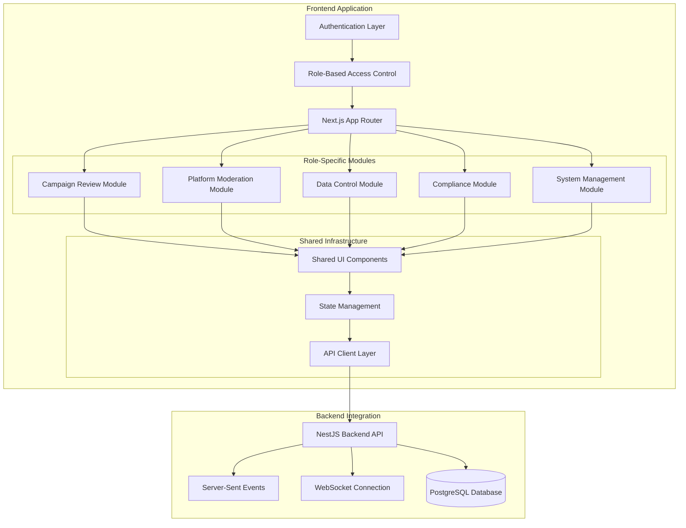
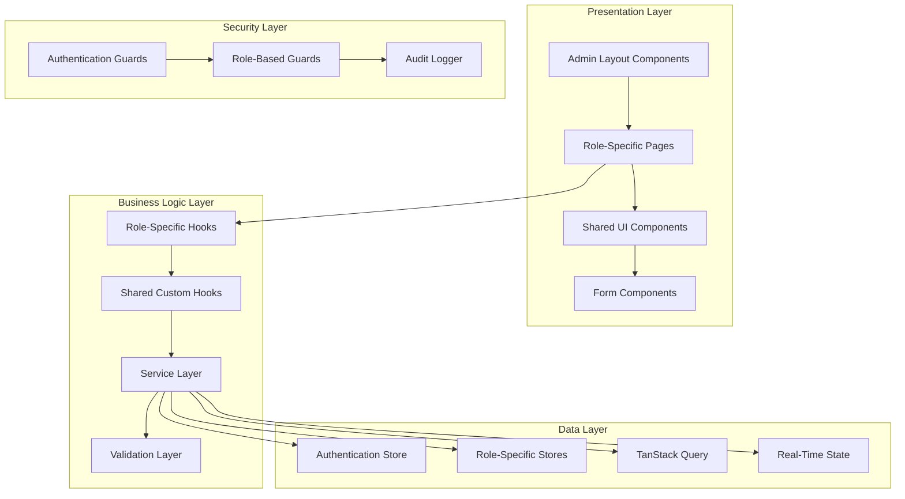
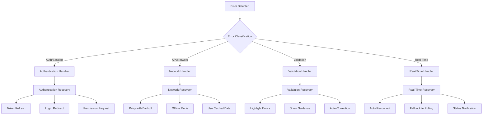
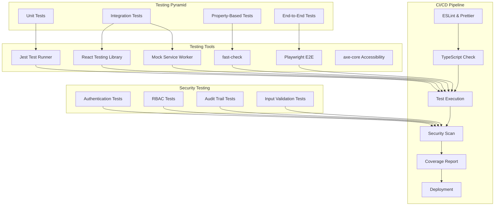

# Design Document: System Admin Frontend

## Overview

The System Admin Frontend is a comprehensive administrative interface for managing a survey platform with five distinct administrative roles: Campaign Reviewer, Platform Moderator, Data Controller, Compliance Officer, and System Manager. This React/Next.js application provides specialized dashboards and workflows for each role while maintaining a unified, secure, and scalable architecture.

The frontend serves as the central command center for platform operations, integrating deeply with the existing NestJS backend to provide real-time monitoring, content moderation, data governance, compliance management, and system administration capabilities. The application emphasizes role-based access control, audit transparency, and operational efficiency.

Key architectural principles include:
- **Role-Based Architecture**: Specialized interfaces tailored to each administrative role
- **Security-First Design**: Comprehensive authentication, authorization, and audit logging
- **Real-Time Operations**: Live updates for queues, metrics, and system status
- **Scalable Modular Design**: Domain-driven component organization for maintainability
- **Compliance-Ready**: Built-in privacy controls and regulatory compliance features

## Architecture

### High-Level Architecture



### Component Architecture

The application follows a modular, role-based architecture with clear separation between administrative domains:



### Technology Stack

- **Frontend Framework**: Next.js 14 with App Router and TypeScript
- **UI Framework**: React 18 with shadcn/ui component library
- **Styling**: Tailwind CSS with custom admin theme
- **State Management**: 
  - Zustand for client-side state (UI state, role context)
  - TanStack Query for server state management and caching
- **Authentication**: JWT with httpOnly cookies and refresh token rotation
- **Real-Time Updates**: Server-Sent Events (SSE) for live notifications and updates
- **Form Management**: React Hook Form with Zod validation
- **Data Visualization**: Recharts for analytics dashboards and metrics
- **File Handling**: React Dropzone for file uploads with progress tracking

## Components and Interfaces

### Core Application Components

#### 1. Authentication & Authorization System
**Purpose**: Manages secure access to administrative functions with role-based permissions.

**Key Features**:
- Multi-factor authentication support
- Role-based route protection
- Session management with automatic refresh
- Audit logging for all authentication events

**Interface**:
```typescript
interface AdminAuthContext {
  user: AdminUser | null;
  role: AdminRole;
  permissions: Permission[];
  login: (credentials: AdminCredentials) => Promise<void>;
  logout: () => void;
  hasPermission: (permission: string) => boolean;
  isAuthenticated: boolean;
  sessionExpiry: Date | null;
}

interface AdminUser {
  id: string;
  email: string;
  name: string;
  role: AdminRole;
  permissions: Permission[];
  lastLogin: Date;
  mfaEnabled: boolean;
}

type AdminRole = 'campaign_reviewer' | 'platform_moderator' | 'data_controller' | 'compliance_officer' | 'system_manager';
```

#### 2. Campaign Review Dashboard
**Purpose**: Provides Campaign Reviewers with tools to review, approve, and manage survey campaigns.

**Key Features**:
- Campaign queue management with status-based grouping
- Detailed campaign preview with survey flow visualization
- Bulk approval/rejection operations
- Quality scoring and automated validation
- SLA tracking and performance metrics

**Interface**:
```typescript
interface CampaignReviewDashboardProps {
  filters: CampaignFilters;
  onFilterChange: (filters: CampaignFilters) => void;
  onCampaignAction: (campaignId: string, action: ReviewAction) => void;
}

interface CampaignFilters {
  status: CampaignStatus[];
  dateRange: DateRange;
  advertiser?: string;
  category?: string;
  priority?: PriorityLevel;
}

interface ReviewAction {
  type: 'approve' | 'reject' | 'request_revision';
  comment?: string;
  reviewerId: string;
}
```

#### 3. Platform Moderation Center
**Purpose**: Enables Platform Moderators to manage content safety and user behavior.

**Key Features**:
- Moderation queue with flagged content prioritization
- AI-assisted content analysis with confidence scores
- User account management and suspension tools
- Spam and duplicate detection systems
- Moderation analytics and trend analysis

**Interface**:
```typescript
interface ModerationCenterProps {
  queue: ModerationItem[];
  onModerationAction: (itemId: string, action: ModerationAction) => void;
  filters: ModerationFilters;
}

interface ModerationItem {
  id: string;
  type: 'campaign' | 'user_report' | 'suspicious_activity';
  content: any;
  severity: 'low' | 'medium' | 'high' | 'critical';
  aiConfidence?: number;
  reportCount: number;
  submittedAt: Date;
}

interface ModerationAction {
  type: 'approve' | 'remove' | 'warn_user' | 'suspend_user' | 'escalate';
  reason: string;
  duration?: number; // for suspensions
}
```

#### 4. Data Control Panel
**Purpose**: Provides Data Controllers with comprehensive data governance and export capabilities.

**Key Features**:
- Data access control management
- Multi-format export with anonymization options
- Data quality validation and cleanup tools
- Real-time response monitoring
- Data retention policy enforcement

**Interface**:
```typescript
interface DataControlPanelProps {
  accessRequests: DataAccessRequest[];
  onAccessDecision: (requestId: string, decision: AccessDecision) => void;
  onDataExport: (config: ExportConfig) => void;
}

interface DataAccessRequest {
  id: string;
  requesterId: string;
  datasetId: string;
  purpose: string;
  requestedAt: Date;
  status: 'pending' | 'approved' | 'denied';
}

interface ExportConfig {
  datasetId: string;
  format: 'csv' | 'excel' | 'json';
  anonymization: AnonymizationOptions;
  filters: DataFilters;
}

interface AnonymizationOptions {
  removePII: boolean;
  aggregateResponses: boolean;
  maskIdentifiers: boolean;
  customRules: AnonymizationRule[];
}
```

#### 5. Compliance Management Interface
**Purpose**: Enables Compliance Officers to manage privacy regulations and data requests.

**Key Features**:
- Privacy compliance configuration for multiple regulations
- User consent tracking and management
- PII detection and flagging systems
- Data request processing (GDPR, CCPA)
- Regional restriction management

**Interface**:
```typescript
interface ComplianceInterfaceProps {
  regulations: ComplianceRegulation[];
  dataRequests: DataRequest[];
  onRegulationUpdate: (regulation: ComplianceRegulation) => void;
  onDataRequestAction: (requestId: string, action: DataRequestAction) => void;
}

interface ComplianceRegulation {
  id: string;
  name: 'GDPR' | 'CCPA' | 'PIPEDA' | 'LGPD';
  enabled: boolean;
  settings: RegulationSettings;
  lastUpdated: Date;
}

interface DataRequest {
  id: string;
  userId: string;
  type: 'export' | 'deletion' | 'correction';
  status: 'pending' | 'processing' | 'completed' | 'denied';
  requestedAt: Date;
  deadline: Date;
}
```

#### 6. System Management Console
**Purpose**: Provides System Managers with platform configuration and monitoring tools.

**Key Features**:
- User and role management
- Platform configuration and feature toggles
- System performance monitoring
- Notification system management
- Audit log viewing and analysis

**Interface**:
```typescript
interface SystemConsoleProps {
  users: AdminUser[];
  systemMetrics: SystemMetrics;
  onUserAction: (userId: string, action: UserAction) => void;
  onConfigUpdate: (config: SystemConfig) => void;
}

interface SystemMetrics {
  activeUsers: number;
  responseTime: number;
  errorRate: number;
  queueSizes: QueueMetrics;
  systemHealth: HealthStatus;
}

interface UserAction {
  type: 'create' | 'update' | 'deactivate' | 'reset_password';
  data: Partial<AdminUser>;
}
```

### Shared Infrastructure Components

#### 1. Real-Time Notification System
**Purpose**: Provides live updates and notifications across all admin interfaces.

**Key Features**:
- Server-Sent Events integration
- Role-based notification filtering
- Toast notifications with action buttons
- Notification history and management

#### 2. Audit Trail Viewer
**Purpose**: Displays comprehensive audit logs for all administrative actions.

**Key Features**:
- Advanced filtering and search capabilities
- Export functionality for compliance reporting
- Real-time log streaming
- Detailed action context and metadata

#### 3. Data Visualization Components
**Purpose**: Provides consistent charts and metrics across all admin dashboards.

**Key Features**:
- Real-time updating charts
- Interactive filtering and drill-down
- Export capabilities for reports
- Responsive design for all screen sizes

## Data Models

### Core Administrative Data Models

```typescript
interface AdminSession {
  id: string;
  userId: string;
  role: AdminRole;
  permissions: Permission[];
  createdAt: Date;
  expiresAt: Date;
  lastActivity: Date;
  ipAddress: string;
  userAgent: string;
}

interface AuditLogEntry {
  id: string;
  userId: string;
  action: string;
  resource: string;
  resourceId?: string;
  details: Record<string, any>;
  timestamp: Date;
  ipAddress: string;
  userAgent: string;
  sessionId: string;
}

interface Permission {
  id: string;
  name: string;
  resource: string;
  action: string;
  conditions?: PermissionCondition[];
}

interface PermissionCondition {
  field: string;
  operator: 'equals' | 'not_equals' | 'in' | 'not_in';
  value: any;
}
```

### Campaign Management Data Models

```typescript
interface CampaignReviewItem {
  id: string;
  campaignId: string;
  title: string;
  advertiser: AdvertiserInfo;
  status: CampaignStatus;
  submittedAt: Date;
  reviewDeadline: Date;
  priorityScore: number;
  qualityScore: QualityScore;
  reviewHistory: ReviewHistoryEntry[];
}

interface QualityScore {
  overall: number;
  clarity: number;
  completeness: number;
  biasDetection: number;
  flaggedIssues: QualityIssue[];
}

interface QualityIssue {
  type: 'bias' | 'clarity' | 'completeness' | 'logic_error';
  severity: 'low' | 'medium' | 'high';
  description: string;
  questionId?: string;
}
```

### Moderation Data Models

```typescript
interface ModerationQueue {
  items: ModerationItem[];
  totalCount: number;
  priorityDistribution: Record<string, number>;
  averageResolutionTime: number;
}

interface UserAccountInfo {
  id: string;
  email: string;
  registrationDate: Date;
  campaignCount: number;
  violationHistory: Violation[];
  trustScore: number;
  status: 'active' | 'warned' | 'suspended' | 'banned';
}

interface Violation {
  id: string;
  type: string;
  description: string;
  severity: 'minor' | 'major' | 'severe';
  date: Date;
  action: string;
}
```

### Data Governance Models

```typescript
interface DataAccessControl {
  userId: string;
  datasetId: string;
  permissions: DataPermission[];
  grantedBy: string;
  grantedAt: Date;
  expiresAt?: Date;
}

interface DataPermission {
  action: 'read' | 'export' | 'analyze';
  conditions?: DataCondition[];
}

interface DataCondition {
  field: string;
  operator: string;
  value: any;
}

interface DataExportJob {
  id: string;
  requesterId: string;
  config: ExportConfig;
  status: 'queued' | 'processing' | 'completed' | 'failed';
  progress: number;
  createdAt: Date;
  completedAt?: Date;
  downloadUrl?: string;
  error?: string;
}
```

## Correctness Properties

*A property is a characteristic or behavior that should hold true across all valid executions of a system-essentially, a formal statement about what the system should do. Properties serve as the bridge between human-readable specifications and machine-verifiable correctness guarantees.*

### Property 1: Campaign Status Grouping Accuracy

*For any* collection of campaigns with various statuses, the Campaign Review Dashboard should correctly group campaigns by their status (Pending, Approved, Rejected, Revision_Requested) with each campaign appearing in exactly one group.

**Validates: Requirements 1.1**

### Property 2: Campaign Metadata Display Completeness

*For any* campaign object with metadata fields, the Campaign Review Dashboard should display all required metadata including title, advertiser, submission date, and priority score without omitting any fields.

**Validates: Requirements 1.2**

### Property 3: Campaign Preview Data Integrity

*For any* campaign selected from the review queue, the campaign preview should display all campaign components (questions, branching logic, targeting criteria) with complete data preservation.

**Validates: Requirements 2.1**

### Property 4: Audit Log Recording Consistency

*For any* administrative action performed by a reviewer, the system should create an audit log entry containing timestamp, reviewer identity, and action details with no missing required fields.

**Validates: Requirements 3.5**

### Property 5: Data Access Control Display Accuracy

*For any* set of user-dataset access mappings, the data access control interface should display all current access relationships without duplicates or omissions.

**Validates: Requirements 10.1**

### Property 6: PII Anonymization Completeness

*For any* dataset containing PII fields, the anonymization process should remove or mask all PII fields while preserving non-PII data integrity when anonymization is enabled.

**Validates: Requirements 11.3**

### Property 7: User Account Operation Success

*For any* valid user account operation (create, modify, deactivate), the system should complete the operation successfully and reflect the changes in the user management interface.

**Validates: Requirements 21.2**

### Property 8: Audit Log Filtering Accuracy

*For any* audit log dataset and filter criteria (date range, user, action type, resource), the filtering should return only entries that match all specified criteria.

**Validates: Requirements 28.2**

### Property 9: Authentication Enforcement Universality

*For any* administrative function endpoint, the system should require valid authentication and reject all unauthenticated access attempts.

**Validates: Requirements 29.1**

## Error Handling

### Error Categories and Recovery Strategies

#### 1. Authentication and Authorization Errors
- **Token Expiration**: Automatic refresh with fallback to login redirect
- **Insufficient Permissions**: Display appropriate error message with contact information
- **Session Timeout**: Graceful logout with session preservation for recovery
- **MFA Failures**: Clear error messages with retry options

#### 2. API Communication Errors
- **Network Connectivity**: Offline indicator with retry mechanisms
- **Server Errors (5xx)**: User-friendly messages with support contact
- **Rate Limiting**: Display wait time and automatic retry
- **Timeout Errors**: Retry with exponential backoff

#### 3. Data Validation Errors
- **Form Validation**: Field-level error messages with correction guidance
- **File Upload Errors**: Progress indication with detailed error reporting
- **Data Format Errors**: Clear format requirements and examples
- **Business Rule Violations**: Contextual explanations with resolution steps

#### 4. Real-Time Communication Errors
- **SSE Connection Loss**: Automatic reconnection with status indication
- **WebSocket Failures**: Fallback to polling with degraded functionality
- **Message Delivery Failures**: Retry mechanisms with failure notifications

### Error Recovery Mechanisms



## Testing Strategy

### Dual Testing Approach

The System Admin Frontend employs a comprehensive testing strategy combining unit tests for specific scenarios and property-based tests for universal behaviors:

#### Unit Testing Strategy
- **Component Testing**: React Testing Library for UI component behavior and interactions
- **Integration Testing**: Mock Service Worker (MSW) for API integration testing
- **Role-Based Testing**: Verify role-specific functionality and access controls
- **Form Testing**: Comprehensive validation and submission testing
- **Real-Time Testing**: Mock SSE and WebSocket connections for live features

#### Property-Based Testing Strategy
- **Library**: fast-check for JavaScript/TypeScript property-based testing
- **Configuration**: Minimum 100 iterations per property test
- **Coverage**: All identified correctness properties from the design document
- **Tagging**: Each property test tagged with feature name and property reference

**Property Test Configuration Example**:
```typescript
// Feature: system-admin-frontend, Property 1: Campaign Status Grouping Accuracy
describe('Campaign Review Properties', () => {
  it('should correctly group campaigns by status', () => {
    fc.assert(fc.property(
      campaignCollectionArbitrary(),
      (campaigns) => {
        const grouped = groupCampaignsByStatus(campaigns);
        const allStatuses = ['Pending', 'Approved', 'Rejected', 'Revision_Requested'];
        
        // Verify each campaign appears in exactly one group
        const totalCampaigns = allStatuses.reduce(
          (sum, status) => sum + (grouped[status]?.length || 0), 0
        );
        expect(totalCampaigns).toBe(campaigns.length);
        
        // Verify correct grouping
        allStatuses.forEach(status => {
          grouped[status]?.forEach(campaign => {
            expect(campaign.status).toBe(status);
          });
        });
      }
    ), { numRuns: 100 });
  });
});
```

#### Security Testing
- **Authentication Testing**: Verify JWT handling, session management, and MFA flows
- **Authorization Testing**: Test role-based access controls and permission enforcement
- **Input Sanitization**: Validate XSS prevention and injection attack protection
- **Audit Testing**: Verify comprehensive logging of administrative actions

#### Performance Testing
- **Load Testing**: Simulate multiple concurrent admin users
- **Real-Time Performance**: Test SSE and WebSocket performance under load
- **Large Dataset Testing**: Verify performance with large audit logs and user lists
- **Memory Leak Testing**: Long-running admin sessions stability

#### Accessibility Testing
- **Automated Testing**: axe-core integration for WCAG 2.1 AA compliance
- **Keyboard Navigation**: Comprehensive keyboard-only navigation testing
- **Screen Reader Testing**: Compatibility with assistive technologies
- **Color Contrast**: Verify sufficient contrast ratios for all UI elements

#### End-to-End Testing
- **Admin Workflows**: Complete administrative task workflows for each role
- **Cross-Role Integration**: Test interactions between different admin roles
- **Data Flow Testing**: End-to-end data processing and audit trail verification
- **Error Scenario Testing**: Comprehensive error handling and recovery testing

### Testing Infrastructure



### Quality Assurance Metrics

- **Code Coverage**: Minimum 85% line coverage, 95% for security-critical paths
- **Property Test Coverage**: 100% of identified correctness properties implemented
- **Security Coverage**: 100% of authentication and authorization paths tested
- **Performance Benchmarks**: 
  - Initial page load < 2 seconds
  - Real-time updates < 500ms latency
  - Large dataset operations < 5 seconds
- **Accessibility Compliance**: WCAG 2.1 Level AA automated and manual testing
- **Cross-Browser Testing**: Support for Chrome, Firefox, Safari, and Edge

This comprehensive testing strategy ensures the System Admin Frontend maintains high security, reliability, and usability standards while providing efficient administrative capabilities across all supported roles and workflows.